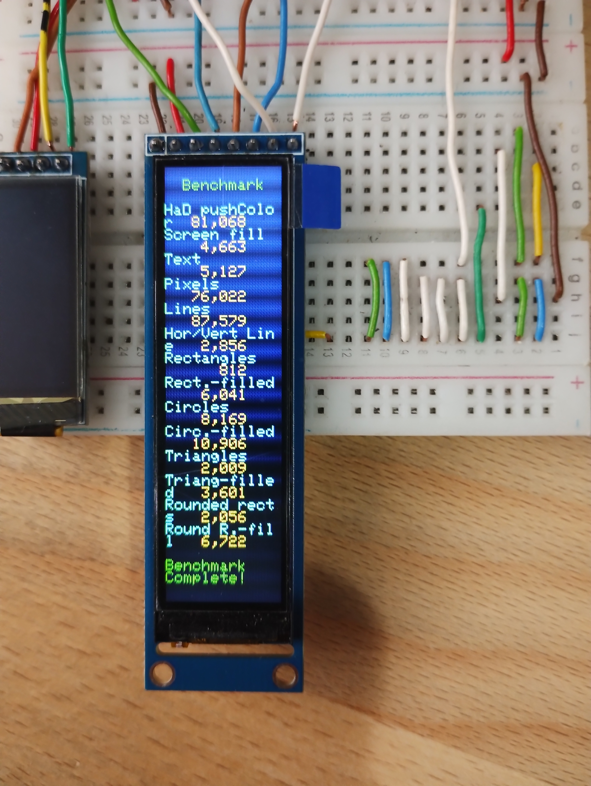

# Display 76x284

Quick test of the display 76x284.

To work properly, the file [libraries/TFT_eSPI/TFT_Drivers/ST7789_Rotation.h](libraries/TFT_eSPI/TFT_Drivers/ST7789_Rotation.h) must be modified for all four rotations:

```
...
// colstart and rowstart for display 76x284 added
else if(_init_width == 76)      {
  colstart = 82;  // 18
  rowstart = 18;  // 82
}
...    
```
Graphics test :



All files can be found here :

- Graphics test : [ESP32_C3_TFT_graphicstest_76x284/ESP32_C3_TFT_graphicstest_76x284.ino](ESP32_C3_TFT_graphicstest_76x284/ESP32_C3_TFT_graphicstest_76x284.ino)
- Setup files : [libraries/Setup427_C3_ST7789_76x284.h](libraries/Setup427_C3_ST7789_76x284.h) and [libraries/TFT_eSPI/User_Setup_Select.h](libraries/TFT_eSPI/User_Setup_Select.h)
- Modified Rotation.h : [libraries/TFT_eSPI/TFT_Drivers/ST7789_Rotation.h](libraries/TFT_eSPI/TFT_Drivers/ST7789_Rotation.h)


