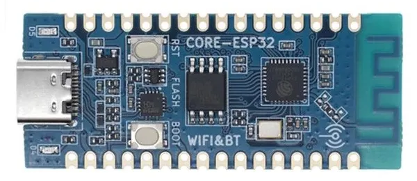
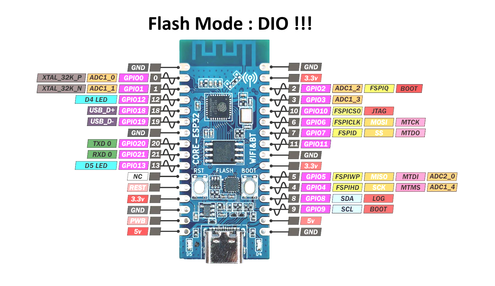

# ESP32-C3 (S2, S3) and esp32 board 3.0.2 package and ST7789 SPI displays

Cheap Aliexpress displays, tested with a Tasmota Core ESP32-C3, Arduino IDE 2.3.2 and TFT_eSPI 2.5.43

**Board Package :** esp32 3.0.2 ( or esp32 2.0.14 )

**Arduino IDE Board :** ESP32-C3 Dev Module

All three IPS displays worked stable at 80MHz.


Tasmota Core ESP32-C3

## [ESP32-S2](ESP32_S2) or [ESP32-S3](ESP32_S3), TFT_eSPI 2.5.43 and esp32 board package 3.0.3

Add this line to the TFT_eSPI configuration file :

> #define USE_HSPI_PORT // HSPI, Pins 10-13

or comment this line for FSPI on ESP32-S2

> //#define USE_HSPI_PORT // FSPI, Pins 34-37

For the ESP32-S3 use this line

> #define USE_FSPI_PORT // FSPI, Pins 34?-37

## ESP32-C3, TFT_eSPI 2.5.43 and esp32 board package 3.0.3 (2.0.14)

There are two options tested :
1. Downgrade the esp32 board package to version 2.0.14 . This is the latest version with no changes required.
2. For ESP32 board package version 3.0.2, two files need to be modified: [TFT_eSPI_ESP32_C3.h](Arduino/libraries/TFT_eSPI/Processors/TFT_eSPI_ESP32_C3.h) and the ESP32 package file [soc.h](AppData/Local/Arduino15/packages/esp32/esp32-arduino-libs/idf-release_v5.1-bd2b9390ef/esp32c3/include/soc/esp32c3/include/soc/soc.h) for ESP32-C3.

Downgrading is easy, so let's look at the second option :

Edit the file [TFT_eSPI_ESP32_C3.h](Arduino/libraries/TFT_eSPI/Processors/TFT_eSPI_ESP32_C3.h)
> C:\Users\<username>\Documents\Arduino\libraries\TFT_eSPI\Processors\TFT_eSPI_ESP32_C3.h

and replace line 71
```
 #define SPI_PORT SPI2_HOST 
```

with
```
#if ESP_ARDUINO_VERSION_MAJOR < 3
  #define SPI_PORT SPI2_HOST
#else
  #define SPI_PORT 2
#endif
```

Edit the second file [soc.h](AppData/Local/Arduino15/packages/esp32/esp32-arduino-libs/idf-release_v5.1-bd2b9390ef/esp32c3/include/soc/esp32c3/include/soc/soc.h)
>  C:\Users\<username>\AppData\Local\Arduino15\packages\esp32\tools\esp32-arduino-libs\idf-release_v5.1-bd2b9390ef\esp32c3\include\soc\esp32c3\include\soc\soc.h

Replace
```
#define REG_SPI_BASE(i) (((i)==2) ? (DR_REG_SPI2_BASE) : (0))   // only one GPSPI 
```

with
```
#define REG_SPI_BASE(i) (((i)==2) ? (DR_REG_SPI2_BASE) : (DR_REG_SPI0_BASE - ((i) * 0x1000)))
```

That's all. Now the ST7789 display worked with my Tasmota ESP32-C3.

Solution for ESP32 C3 found here :
- TFT_eSPI_ESP32_C3.h : https://github.com/Bodmer/TFT_eSPI/issues/3384#issuecomment-2200970244
- soc.h for ESP32-C3 : https://github.com/espressif/arduino-esp32/issues/9618#issuecomment-2107459271

Quote:

```
The change done in IDF to #define REG_SPI_BASE(i) (((i)>=2) ? (DR_REG_SPI2_BASE + (i-2) * 0x1000) : (0)) // GPSPI2 and GPSPI3
is wrong.  Correct is 
#define REG_SPI_BASE(i) (((i)==2) ? (DR_REG_SPI2_BASE) : (DR_REG_SPI0_BASE - ((i) * 0x1000))) // GPSPI2 and GPSPI3 
Changed this in our IDF fork for Tasmota, which is the base for compiling the Tasmota Arduino libs.
Edit: The changes done for the other SOCs are imho wrong too. Only ESP32 looks correct.
```

## Connections for Tasmota Core ESP32-C3 and ST7789 IPS displays

| GPIO      | TFT   | Description          |
| --------: | :---- | :------------------- |
|         7 | CS    | CS                   |
|         6 | SDA   | MOSI                 |
|         5 | ---   | MISO  ( not used )   |
|         4 | SCL   | SCLK                 |
|        19 | DC    | DC                   |
|        EN | RST   | Reset or PWM-Pin     |
|        18 | BLK   | 3.3V  or PWM-Pin     |
|           | VCC   | 3.3V                 |
|           | GND   | GND                  |


Pinout Tasmota Core ESP32-C3

## Configuring the TFT_eSPI

Edit or copy the setup file [Setup421_C3_ST7789_170x320.h](Arduino/libraries/Setup421_C3_ST7789_170x320.h) or
  [Setup422_C3_ST7789_240x280.h](Arduino/libraries/Setup422_C3_ST7789_240x280.h) or [Setup423_C3_ST7789_240x320.h](Setup423_C3_ST7789_240x320.h) :
```java
#define USER_SETUP_ID 421 // 422 // 423

// Driver
#define ST7789_DRIVER   // Configure all registers

#define TFT_WIDTH  170  // 240 // 240 
#define TFT_HEIGHT 320  // 280 // 320

//#define TFT_RGB_ORDER TFT_BGR  // only for display 240x320 
//#define TFT_INVERSION_ON       // only for display 240x320

// Pins ESP32 C3
#define TFT_CS    10
#define TFT_MOSI  11
#define TFT_SCLK  12
#define TFT_MISO  13
#define TFT_DC     7
#define TFT_RST   -1  // Set TFT_RST to -1 if display RESET is connected to ESP32 board EN

// Fonts
#define LOAD_GLCD
#define LOAD_FONT2
#define LOAD_FONT4
#define LOAD_FONT6
#define LOAD_FONT7
#define LOAD_FONT8
//#define LOAD_FONT8N
#define LOAD_GFXFF

#define SMOOTH_FONT

// FSPI / VSPI port (SPI2) used unless following defined. HSPI port is (SPI3) on S3.
//#define USE_HSPI_PORT   // For ESP32 S3 and esp32 board package > 2.0.14

// Other options
//#define SPI_FREQUENCY  27000000  // 80/3 MHz
//#define SPI_FREQUENCY  40000000  // 80/2 MHz
#define SPI_FREQUENCY    80000000  // 80/1 MHz
```

Edit or copy the file [User_Setup_Select.h](Arduino/libraries/TFT_eSPI/User_Setup_Select.h)

## Test programs

All files can be found above in the folder Arduino.

- [Arduino/ESP32_C3_TFT_graphicstest_170x320.ino](Arduino/ESP32_C3_TFT_graphicstest_170x320/ESP32_C3_TFT_graphicstest_170x320.ino) 
- [Arduino/ESP32_C3_TFT_graphicstest_240x280.ino](Arduino/ESP32_C3_TFT_graphicstest_240x280/ESP32_C3_TFT_graphicstest_240x280.ino)
- [Arduino/ESP32_C3_TFT_graphicstest_240x320.ino](Arduino/ESP32_C3_TFT_graphicstest_240x320/ESP32_C3_TFT_graphicstest_240x320.ino)
