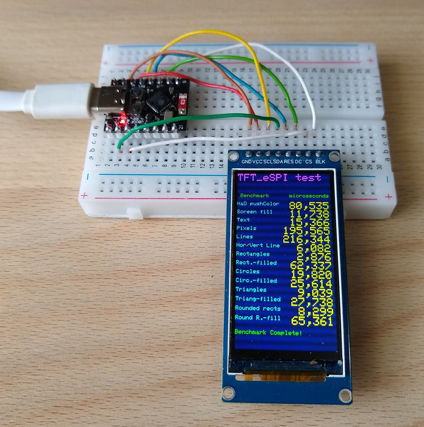
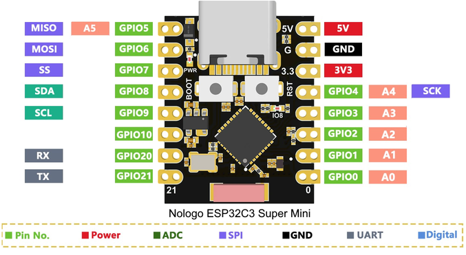
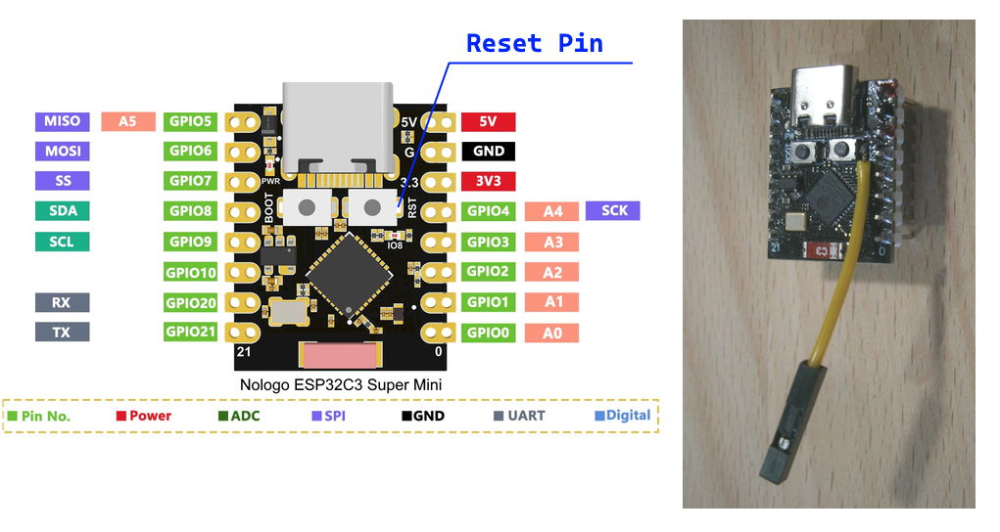

# ESP32-C3 Super Mini and ST7789 SPI displays

Cheap Aliexpress displays, tested with an ESP32-C3 Super Mini, Arduino IDE 2.3.2 and TFT_eSPI 2.5.43

**Board Package :** esp32 3.0.3 ( or esp32 2.0.14 )

**Arduino IDE**
- **Board :** "Nologo ESP32-C3 Super Mini" or "ESP32-C3 Dev Module"
- **USB CDC On Boot :** Enabled (for serial monitor)
- **Upload problem :** 
  - Method 1: Press and hold BOOT while connecting. 
  - Method 2: Press and hold the BOOT button then press the RESET button.

There is a [manual](documents/manual.pdf) for the ESP32-C3 Super Mini.


ESP32-C3 Super Mini


## Problems with esp32 board package 3.0.3 and TFT_eSPI 2.5.43

are discussed here :
- [../ESP32_C3/README.md](../ESP32_C3/README.md)
- [../ESP32_C6/README.md](../ESP32_C6/README.md)
- [../ESP32_H2/README.md](../ESP32_H2/README.md) 

## Connections for ESP32-C3 Super Mini and ST7789 IPS displays

| GPIO      | TFT   | Description          |
| --------: | :---- | :------------------- |
|         7 | CS    | CS                   |
|         6 | SDA   | MOSI                 |
|         5 | ---   | MISO  ( not used )   |
|         4 | SCL   | SCLK                 |
|         2 | DC    | DC                   |
|         3 | RST   | Reset                |
|         1 | BLK   | 3.3V or PWM-Pin      |
|           | VCC   | 3.3V                 |
|           | GND   | GND                  |


Arduino IDE Board : "Nologo ESP32C3 Super Mini" or "ESP32C3 Dev Module", USB CDC On Boot : Enabled

## Add Reset Pin for the ESP32-C3 Super Mini




## Configuring the TFT_eSPI

Edit or copy the setup file [Setup424_C3_SM_ST7789_170x320.h](Arduino/libraries/Setup424_C3_SM_ST7789_170x320.h) ,
  [Setup425_C3_SM_ST7789_240x280.h](Arduino/libraries/Setup422_C3_ST7789_240x280.h) or [Setup426_C3_SM_ST7789_240x320.h](Setup426_C3_SM_ST7789_240x320.h) :

```java
#define USER_SETUP_ID 424 // 425 // 426

// Driver
#define ST7789_DRIVER   // Configure all registers

#define TFT_WIDTH  170  // 240 // 240 
#define TFT_HEIGHT 320  // 280 // 320

//#define TFT_RGB_ORDER TFT_BGR  // only for display 240x320 
//#define TFT_INVERSION_ON       // only for display 240x320

// Pins ESP32 C3
#define TFT_CS     7
#define TFT_MOSI   6
#define TFT_MISO   5
#define TFT_SCLK   4
#define TFT_RST    3
#define TFT_DC     2
//#define TFT_BL   1

// Fonts
#define LOAD_GLCD
#define LOAD_FONT2
#define LOAD_FONT4
#define LOAD_FONT6
#define LOAD_FONT7
#define LOAD_FONT8
//#define LOAD_FONT8N
#define LOAD_GFXFF

#define SMOOTH_FONT

// Other options
//#define SPI_FREQUENCY  27000000  // 80/3 MHz
//#define SPI_FREQUENCY  40000000  // 80/2 MHz
#define SPI_FREQUENCY    80000000  // 80/1 MHz
```

Edit or copy the file [Arduino/libraries/TFT_eSPI/User_Setup_Select.h](Arduino/libraries/TFT_eSPI/User_Setup_Select.h)

## Test programs

All files can be found above in the folder Arduino.

- [Arduino/ESP32_C3_mini_TFT_graphicstest_170x320.ino](Arduino/ESP32_C3_mini_TFT_graphicstest_170x320/ESP32_C3_mini_TFT_graphicstest_170x320.ino) 
- [Arduino/ESP32_C3_mini_TFT_graphicstest_240x280.ino](Arduino/ESP32_C3_mini_TFT_graphicstest_240x280/ESP32_C3_mini_TFT_graphicstest_240x280.ino)
- [Arduino/ESP32_C3_mini_TFT_graphicstest_240x320.ino](Arduino/ESP32_C3_mini_TFT_graphicstest_240x320/ESP32_C3_mini_TFT_graphicstest_240x320.ino)
