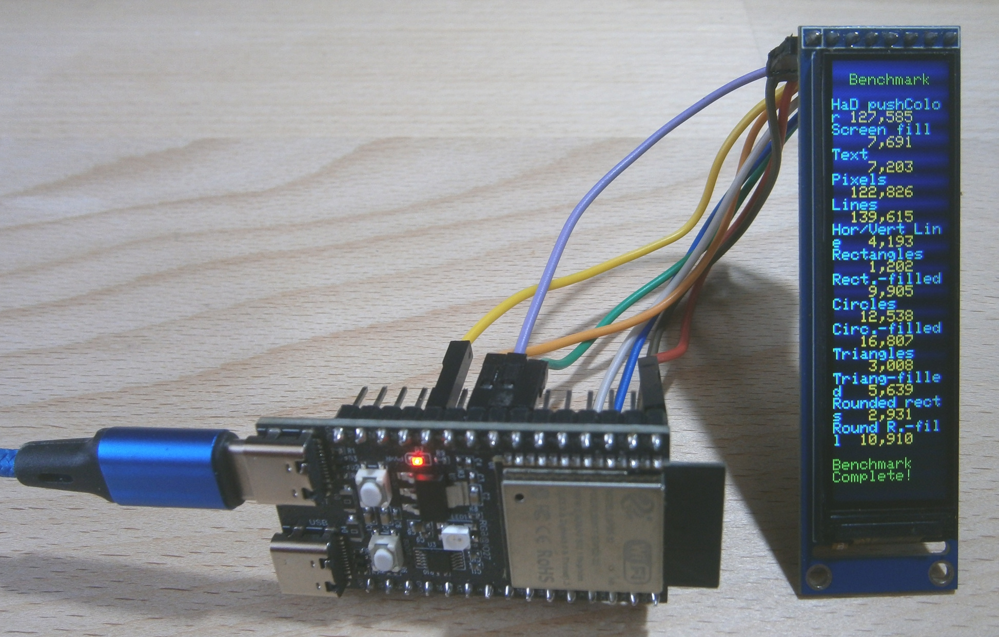
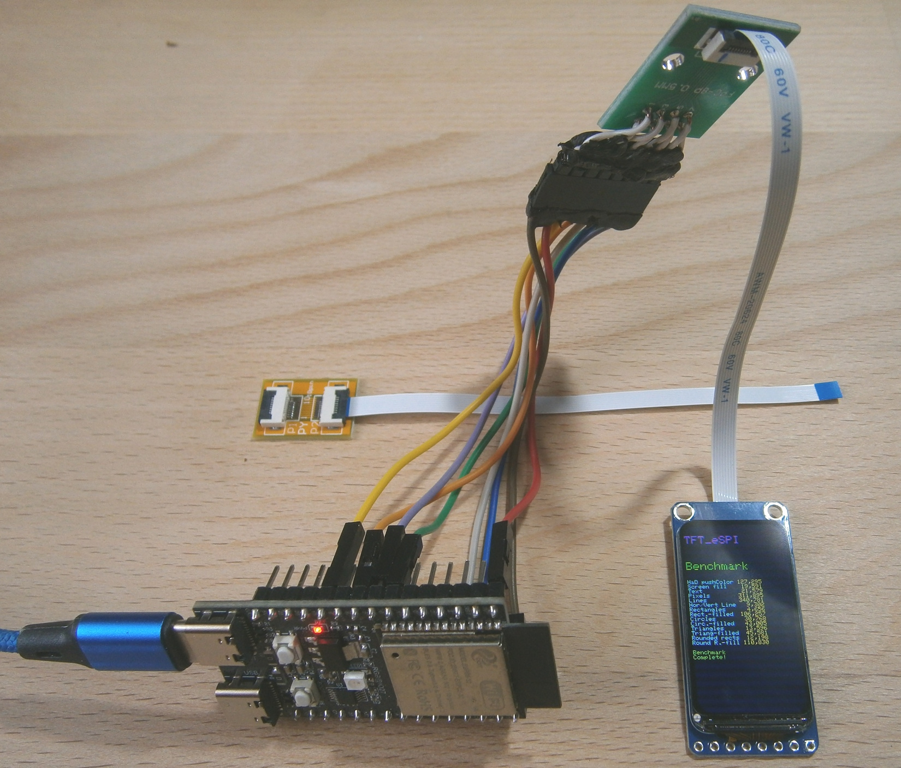
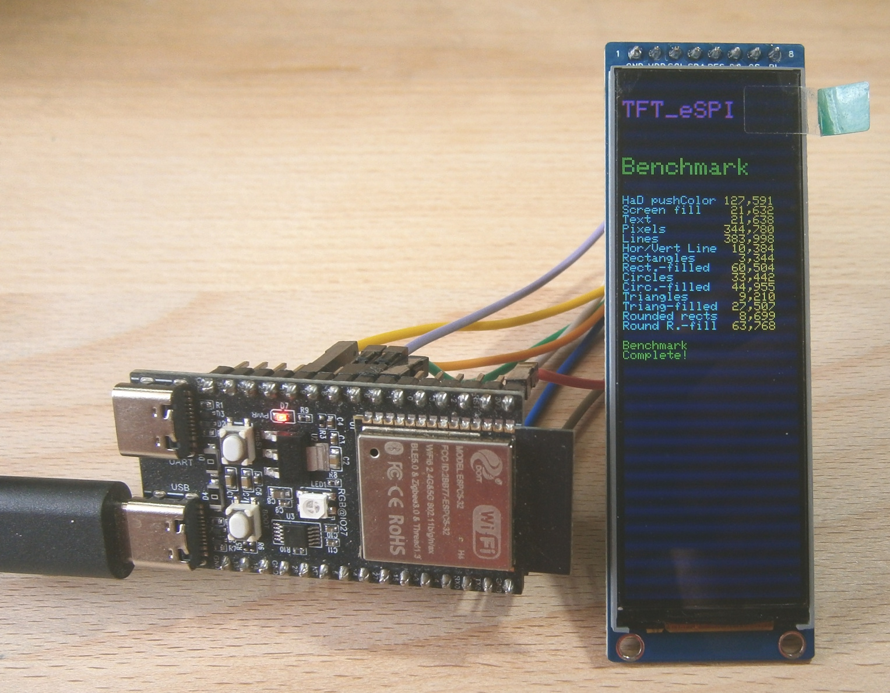
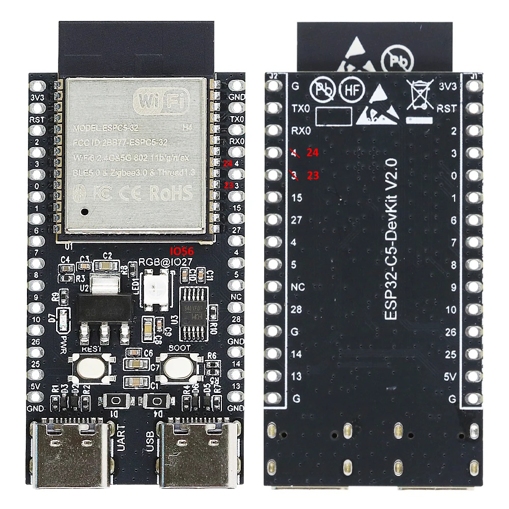

<<<<<<< HEAD
# ESP32-C5 DevKit V2.0, esp32 board package 3.3.11 and some SPI displays (ST7789 or NV3007)

A similar test with an **ESP32-P4 WT9932P4** can be found in the folder [ESP32_P4_WT9932P4](../ESP32_P4_WT9932P4/README.md).

Cheap Aliexpress displays, tested with an ESP32-C5 DevKit V2.0, Arduino IDE 2.3.10 and a modified TFT_eSPI 2.5.43

**Board Package :** esp32 3.3.11

**Arduino IDE Board :** ESP32C5 Dev Module

**USB CDC On Boot :** Disabled (default)


ESP32-C5 DevKit V2.0 with Display ST7789 76x284


ESP32-C5 DevKit V2.0 with Display ST7789 172x320


ESP32-C5 DevKit V2.0 with Display **NV3007** 142x428

## Connections for ESP32 C6 SuperMini and ST7789 displays


ESP32-C5 DevKit V2.0 **RGB-LED : Use virtual pin 56 for digitalWrite() or neopixelWrite()**

| GPIO      | TFT   | Description          |
| --------: | :---- | :------------------- |
|         6 | CS    | CS                   |
|         8 | SDA   | MOSI                 |
|         9 | ---   | MISO  ( not used )   |
|        10 | SCL   | SCLK                 |
|        24 | DC    | DC                   |
|        23 | RST   | Reset                |
|         7 | BLK   | Backlight PWM-Pin    |
|           | VCC   | 3.3V                 |
|           | GND   | GND                  |

## Modifying and configuring the TFT_eSPI

Copy or replace all files from the [libraries](Arduino/libraries/) directory, including its subdirectories. These are only the modified ( or added) files of (to) the original TFT_eSPI 2.5.43 library, needed for the test programs.

The file [TFT_eSPI.zip](Arduino/TFT_eSPI.zip) contains the complete library files of the TFT_eSPI library, including all configuration files i have.

These files also support the NV3007 display, [ESP32-C5](../ESP32_C5_DevKit_V2.0/README.md) and [ESP32-P4](../ESP32_P4_WT9932P4/README.md).

Don't forget to choose the correct configuration file for your display in  [Arduino/libraries/TFT_eSPI/User_Setup_Select.h](Arduino/libraries/TFT_eSPI/User_Setup_Select.h).

## Test programs

All files can be found above in the folder [Arduino](Arduino/).

- [Arduino/ESP32_C5_TFT_graphicstest_76x284](Arduino/ESP32_C5_TFT_graphicstest_76x284/ESP32_C5_TFT_graphicstest_76x284.ino) 
- [Arduino/ESP32_C5_TFT_graphicstest_172x320](Arduino/ESP32_C5_TFT_graphicstest_172x320/ESP32_C5_TFT_graphicstest_172x320.ino) 
- [Arduino/ESP32_C5_TFT_graphicstest_142x428](Arduino/ESP32_C5_TFT_graphicstest_142x428/ESP32_C5_TFT_graphicstest_142x428.ino) 
- [Arduino/ESP32_C5_Pins.ino](Arduino/ESP32_C5_Pins/ESP32_C5_Pins.ino)
- [Arduino/ESP32_C5_Neopixel_RGB](Arduino/ESP32_C5_Neopixel_RGB/ESP32_C5_Neopixel_RGB.ino) 

## Running SPI displays with 80MHz clock speed

\* Most of ESP32's peripheral signals have a direct connection to their dedicated IO_MUX pins. However, the signals can also be routed to any other available pins using the less direct GPIO matrix. If at least one signal is routed through the GPIO matrix, then all signals will be routed through it.

\* The GPIO matrix introduces flexibility of routing but also brings the following disadvantages:
- Increases the input delay of the MISO signal, which makes MISO setup time violations more likely. If SPI needs to operate at high speeds, use dedicated IO_MUX pins.
- Allows signals with clock frequencies only up to 40 MHz, as opposed to 80 MHz if IO_MUX pins are used.

This seems to be different for **ESP32-P4** and **ESP32-S31**.

| Pin \ ESP32 |   C6*|C5,C3,C2*|  C61*|   H2*|S3,S2*|   P4*|  P4**|  S31*|ESP32*|  ESP32*|
| :---------- | ---: |    ---: | ---: | ---: | ---: | ---: | ---: | ---: | ---: |   ---: |
| CS          |   16 |      10 |    8 |    1 |   10 |   7* | 28** |  N/A |   15 |      5 |
| SCLK        |    6 |       6 |    6 |    4 |   12 |   9* | 30** |  N/A |   14 |     18 |
| MISO        |    2 |       2 |    2 |    0 |   13 |  10* | 31** |  N/A |   12 |     19 |
| MOSI        |    7 |       7 |    7 |    5 |   11 |   8* | 29** |  N/A |   13 |     23 |
| QUADWP      |    5 |       5 |    4 |    2 |   14 |  11* | 33** |  N/A |   11 |     22 |
| QUADHD      |    4 |       4 |    3 |    3 |    9 |   6* | 32** |  N/A |    6 |     21 |
|-------------|      |         |      |      |      |      |      |      |      |        |
| SPI Bus     | SPI2 |    SPI2 | SPI2 | SPI2 | SPI2 | SPI2 | SPI2 | SPI2 | SPI2 |**SPI3**|

\* Found in the Espressif online documentation https://docs.espressif.com/projects/esp-idf/en/v6.1/esp32p4/api-reference/peripherals/spi_master.html.

\** The [esp32-p4_datasheet_en.pdf](documents/esp32-p4_datasheet_en.pdf) shows additional pins.

In the test with an [ESP32_P4_WT9932P4](../ESP32_P4_WT9932P4/README.md) the display worked with 80MHz although different pins were used (CS 26, MOSI 32, MISO 33, SCLK 36).

## Using the RGB LED with digitalWrite() 

**RGB_BUILTIN** is defined in AppData\Local\Arduino15\packages\esp32\hardware\esp32\3.3.11\variants\esp32c5\pins_arduino.h :

```
#define PIN_RGB_LED 27

// BUILTIN_LED can be used in new Arduino API digitalWrite() like in Blink.ino
static const uint8_t LED_BUILTIN = SOC_GPIO_PIN_COUNT + PIN_RGB_LED;
#define BUILTIN_LED LED_BUILTIN
#define LED_BUILTIN LED_BUILTIN

// RGB_BUILTIN and RGB_BRIGHTNESS can be used in new Arduino API rgbLedWrite()
#define RGB_BUILTIN    LED_BUILTIN
#define RGB_BRIGHTNESS 64
```
**SOC_GPIO_PIN_COUNT** represents the total number of 29 physical GPIO pins (SOC_GPIO_PIN_COUNT) available on the ESP32-C5 Dev Module. **RGB_BUILTIN** is defined as 29+27=56 so functions like digitalWrite() know to handle the pin using NeoPixel protocols.

## Display controller NV3007

The driver was found here : https://github.com/Bodmer/TFT_eSPI/issues/3851. The line "#define TFT_INIT_DELAY 0x80" had to be added to the "NV3007_Defines.h". Several files also needed to be modified for the driver to work correctly with the TFT_eSPI library.
=======
# ESP32-C5 DevKit V2.0, esp32 board package 3.3.11 and some SPI displays (ST7789 or NV3007)

A similar test with an **ESP32-P4 WT9932P4** can be found in the folder [ESP32_P4_WT9932P4](../ESP32_P4_WT9932P4/README.md).

Cheap Aliexpress displays, tested with an ESP32-C5 DevKit V2.0, Arduino IDE 2.3.10 and a modified TFT_eSPI 2.5.43

**Board Package :** esp32 3.3.11

**Arduino IDE Board :** ESP32C5 Dev Module

**USB CDC On Boot :** Disabled (default)


ESP32-C5 DevKit V2.0 with Display ST7789 76x284


ESP32-C5 DevKit V2.0 with Display ST7789 172x320


ESP32-C5 DevKit V2.0 with Display **NV3007** 142x428

## Connections for ESP32 C6 SuperMini and ST7789 displays


ESP32-C5 DevKit V2.0 **RGB-LED : Use virtual pin 56 for digitalWrite() or neopixelWrite()**

| GPIO      | TFT   | Description          |
| --------: | :---- | :------------------- |
|         6 | CS    | CS                   |
|         8 | SDA   | MOSI                 |
|         9 | ---   | MISO  ( not used )   |
|        10 | SCL   | SCLK                 |
|        24 | DC    | DC                   |
|        23 | RST   | Reset                |
|         7 | BLK   | Backlight PWM-Pin    |
|           | VCC   | 3.3V                 |
|           | GND   | GND                  |

## Modifying and configuring the TFT_eSPI

Copy or replace all files from the [libraries](Arduino/libraries/) directory, including its subdirectories. These are only the modified ( or added) files of (to) the original TFT_eSPI 2.5.43 library, needed for the test programs.

The file [TFT_eSPI.zip](Arduino/TFT_eSPI.zip) contains the complete library files of the TFT_eSPI library, including all configuration files i have.

These files also support the NV3007 display, [ESP32-C5](../ESP32_C5_DevKit_V2.0/README.md) and [ESP32-P4](../ESP32_P4_WT9932P4/README.md).

Don't forget to choose the correct configuration file for your display in  [Arduino/libraries/TFT_eSPI/User_Setup_Select.h](Arduino/libraries/TFT_eSPI/User_Setup_Select.h).

## Test programs

All files can be found above in the folder [Arduino](Arduino/).

- [Arduino/ESP32_C5_TFT_graphicstest_76x284](Arduino/ESP32_C5_TFT_graphicstest_76x284/ESP32_C5_TFT_graphicstest_76x284.ino) 
- [Arduino/ESP32_C5_TFT_graphicstest_172x320](Arduino/ESP32_C5_TFT_graphicstest_172x320/ESP32_C5_TFT_graphicstest_172x320.ino) 
- [Arduino/ESP32_C5_TFT_graphicstest_142x428](Arduino/ESP32_C5_TFT_graphicstest_142x428/ESP32_C5_TFT_graphicstest_142x428.ino) 
- [Arduino/ESP32_C5_Pins.ino](Arduino/ESP32_C5_Pins/ESP32_C5_Pins.ino)
- [Arduino/ESP32_C5_Neopixel_RGB](Arduino/ESP32_C5_Neopixel_RGB/ESP32_C5_Neopixel_RGB.ino) 

## Running SPI displays with 80MHz clock speed

\* Most of ESP32's peripheral signals have a direct connection to their dedicated IO_MUX pins. However, the signals can also be routed to any other available pins using the less direct GPIO matrix. If at least one signal is routed through the GPIO matrix, then all signals will be routed through it.

\* The GPIO matrix introduces flexibility of routing but also brings the following disadvantages:
- Increases the input delay of the MISO signal, which makes MISO setup time violations more likely. If SPI needs to operate at high speeds, use dedicated IO_MUX pins.
- Allows signals with clock frequencies only up to 40 MHz, as opposed to 80 MHz if IO_MUX pins are used.

This seems to be different for **ESP32-P4** and **ESP32-S31**.

| Pin \ ESP32 |   C6*|C5,C3,C2*|  C61*|   H2*|S3,S2*|   P4*|  P4**|  S31*|ESP32*|  ESP32*|
| :---------- | ---: |    ---: | ---: | ---: | ---: | ---: | ---: | ---: | ---: |   ---: |
| CS          |   16 |      10 |    8 |    1 |   10 |   7* | 28** |  N/A |   15 |      5 |
| SCLK        |    6 |       6 |    6 |    4 |   12 |   9* | 30** |  N/A |   14 |     18 |
| MISO        |    2 |       2 |    2 |    0 |   13 |  10* | 31** |  N/A |   12 |     19 |
| MOSI        |    7 |       7 |    7 |    5 |   11 |   8* | 29** |  N/A |   13 |     23 |
| QUADWP      |    5 |       5 |    4 |    2 |   14 |  11* | 33** |  N/A |   11 |     22 |
| QUADHD      |    4 |       4 |    3 |    3 |    9 |   6* | 32** |  N/A |    6 |     21 |
|-------------|      |         |      |      |      |      |      |      |      |        |
| SPI Bus     | SPI2 |    SPI2 | SPI2 | SPI2 | SPI2 | SPI2 | SPI2 | SPI2 | SPI2 |**SPI3**|

\* Found in the Espressif online documentation https://docs.espressif.com/projects/esp-idf/en/v6.1/esp32p4/api-reference/peripherals/spi_master.html.

\** The [esp32-p4_datasheet_en.pdf](documents/esp32-p4_datasheet_en.pdf) shows additional pins.

In the test with an [ESP32_P4_WT9932P4](../ESP32_P4_WT9932P4/README.md) the display worked with 80MHz although different pins were used (CS 26, MOSI 32, MISO 33, SCLK 36).

## Using the RGB LED with neopixelWrite() or digitalWrite() 

**RGB_BUILTIN** is defined in AppData\Local\Arduino15\packages\esp32\hardware\esp32\3.3.11\variants\esp32c5\pins_arduino.h :

```
#define PIN_RGB_LED 27

// BUILTIN_LED can be used in new Arduino API digitalWrite() like in Blink.ino
static const uint8_t LED_BUILTIN = SOC_GPIO_PIN_COUNT + PIN_RGB_LED;
#define BUILTIN_LED LED_BUILTIN
#define LED_BUILTIN LED_BUILTIN

// RGB_BUILTIN and RGB_BRIGHTNESS can be used in new Arduino API rgbLedWrite()
#define RGB_BUILTIN    LED_BUILTIN
#define RGB_BRIGHTNESS 64
```
**SOC_GPIO_PIN_COUNT** represents the total number of 29 physical GPIO pins (SOC_GPIO_PIN_COUNT) available on the ESP32-C5 Dev Module. **RGB_BUILTIN** is defined as 29+27=56 so functions like neopixelWrite() or digitalWrite() know to handle the pin using NeoPixel protocols.

## Display controller NV3007

The driver was found here : https://github.com/Bodmer/TFT_eSPI/issues/3851. The line "#define TFT_INIT_DELAY 0x80" had to be added to the "NV3007_Defines.h". Several files also needed to be modified for the driver to work correctly with the TFT_eSPI library.
>>>>>>> bbe7ee3594158ba10f390e09c823f07448471d5d
