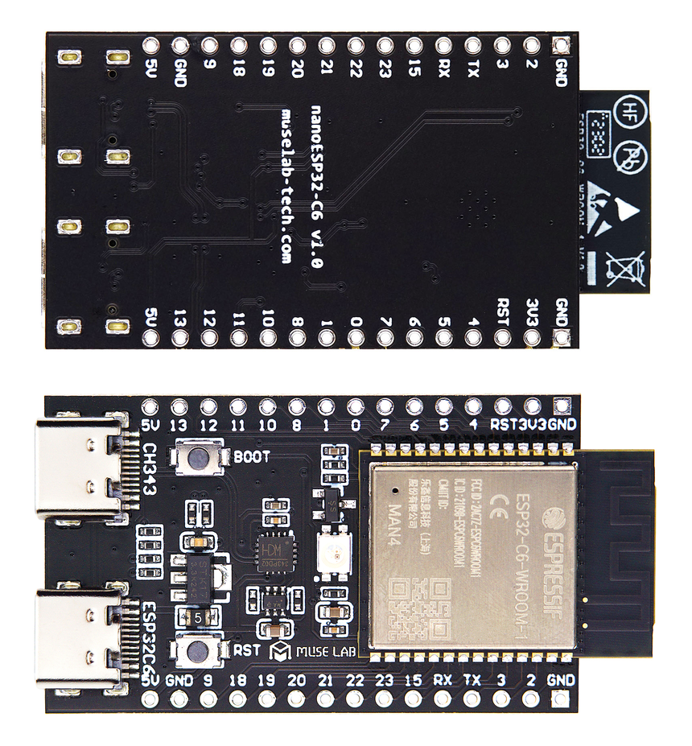
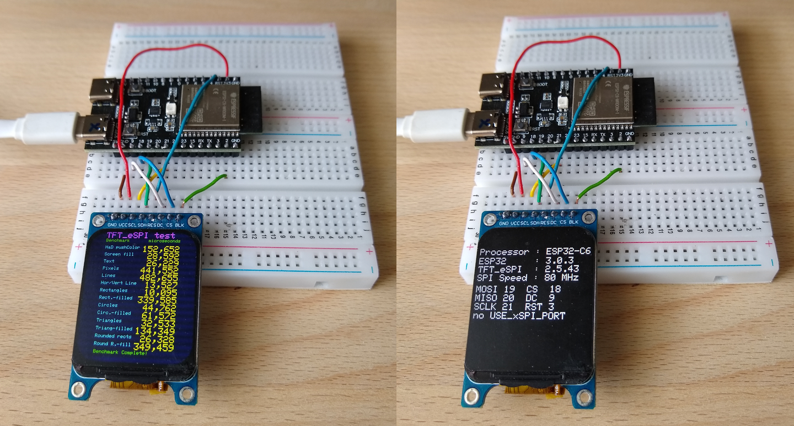
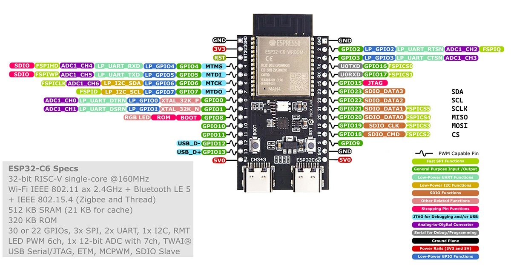

# !!! UNDER CONSTRUCTION !!!

# nanoESP32-C6 and esp32 board package 3.0.3 and ST7789 SPI displays

Similar tests with an ESP32-H2 Super Mini can be found in the folder [ESP32_H2](ESP32_H2/README.md).

Cheap Aliexpress displays, tested with an ESP32-C6, Arduino IDE 2.3.2 and a modified TFT_eSPI 2.5.43 .

**Board Package :** esp32 3.0.3 (or 3.0.4)

**Arduino IDE Board :** ESP32-C6 Dev Module

**USB CDC On Boot :** Enabled

All three IPS displays worked stable at 80MHz.


nanoESP32-C6


Arduino IDE Board : "ESP32C6 Dev Module"


## Connections for nanoESP32-C6 and all ST7789 IPS displays

| GPIO      | TFT   | Description          |
| --------: | :---- | :------------------- |
|        18 | CS    | CS                   |
|        19 | SDA   | MOSI                 |
|        20 | ---   | MISO  ( not used )   |
|        21 | SCL   | SCLK                 |
|         9 | DC    | DC                   |
|       RST | RST   | Reset                |
|         2 | BLK   | 3.3V or PWM-Pin      |
|           | VCC   | 3.3V                 |
|           | GND   | GND                  |


Pinout nanoESP32-C6

## Configuring the TFT_eSPI

Edit or copy the setup file [Setup431_C6_ST7789_170x320.h](Arduino/libraries/Setup431_C6_ST7789_170x320.h) or
  [Setup432_C6_ST7789_240x280.h](Arduino/libraries/Setup432_C6_ST7789_240x280.h) or [Setup433_C6_ST7789_240x320.h](Setup433_C6_ST7789_240x320.h) :
```java

#define USER_SETUP_ID 431 // 432 // 433

// Driver
#define ST7789_DRIVER     // Configure all registers

#define TFT_WIDTH  170    // 240 // 240 // 240
#define TFT_HEIGHT 320    // 280 // 320 // 240

//#define TFT_RGB_ORDER TFT_BGR  // only for display 240x320 
//#define TFT_INVERSION_ON       // only for display 240x320

//Pins ESP32-C6
#define TFT_CS     18 
#define TFT_MOSI   19
#define TFT_MISO   20
#define TFT_SCLK   21  
#define TFT_DC      9
#define TFT_RST    -1   // Set TFT_RST to -1 if display RESET is connected to ESP32 board EN
//#define TFT_BL    2   // LED backlight

#define LOAD_GLCD
#define LOAD_FONT2
#define LOAD_FONT4
#define LOAD_FONT6
#define LOAD_FONT7
#define LOAD_FONT8
//#define LOAD_FONT8N
#define LOAD_GFXFF

#define SMOOTH_FONT 

//#define SPI_FREQUENCY  20000000
//#define SPI_FREQUENCY  27000000  // same speed as with 20MHz
//#define SPI_FREQUENCY  40000000
#define SPI_FREQUENCY  80000000    // same speed as with 40MHz

//#define SPI_READ_FREQUENCY  20000000
//#define SPI_TOUCH_FREQUENCY  2500000
//#define SUPPORT_TRANSACTIONS
```

Edit or copy the file [User_Setup_Select.h](Arduino/libraries/TFT_eSPI/User_Setup_Select.h)

## Modifying the TFT_eSPI

The ESP32-C6 is an upgraded ESP32-C3, so the code of the library TFT_eSPI works here too (but slower).

Four files were modified to verify this :
- [TFT_eSPI.h](Arduino/libraries/TFT_eSPI/TFT_eSPI.h)
- [TFT_eSPI.cpp](Arduino/libraries/TFT_eSPI/TFT_eSPI.cpp)
- [Processors/TFT_eSPI_ESP32_C3.h](Arduino/libraries/TFT_eSPI/Processors/TFT_eSPI_ESP32_C3.h)
- [Processors/TFT_eSPI_ESP32_C3.c](Arduino/libraries/TFT_eSPI/Processors/TFT_eSPI_ESP32_C3.c)

## Test programs

All files can be found above in the folder Arduino.

- [Arduino/ESP32_C6_TFT_graphicstest_170x320.ino](Arduino/ESP32_C6_TFT_graphicstest_170x320/ESP32_C6_TFT_graphicstest_170x320.ino) 
- [Arduino/ESP32_C6_TFT_graphicstest_240x280.ino](Arduino/ESP32_C6_TFT_graphicstest_240x280/ESP32_C6_TFT_graphicstest_240x280.ino)
- [Arduino/ESP32_C6_TFT_graphicstest_240x320.ino](Arduino/ESP32_C6_TFT_graphicstest_240x320/ESP32_C6_TFT_graphicstest_240x320.ino)

