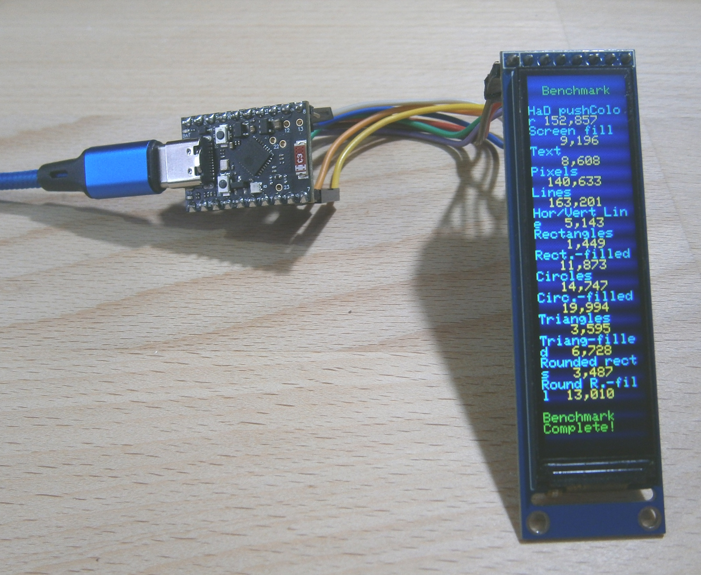
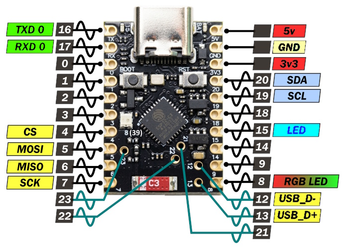
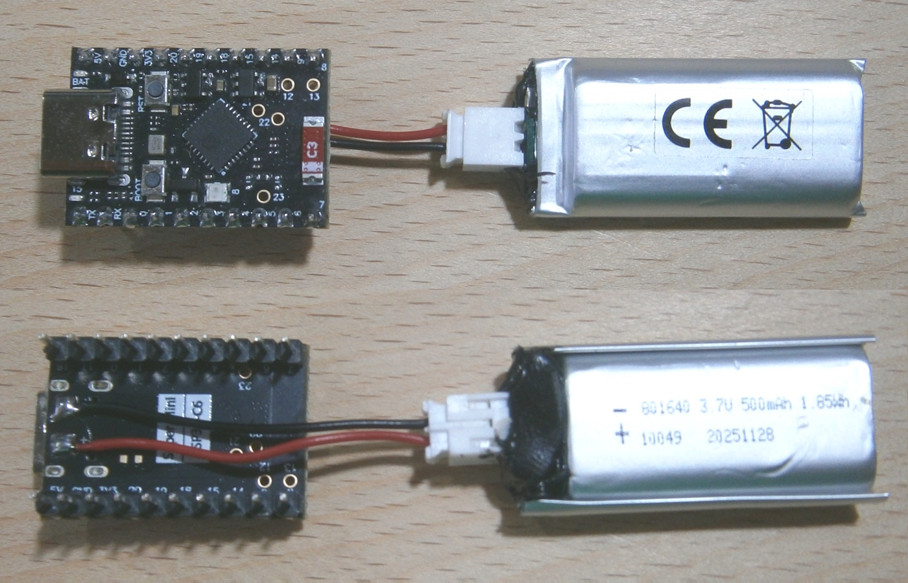
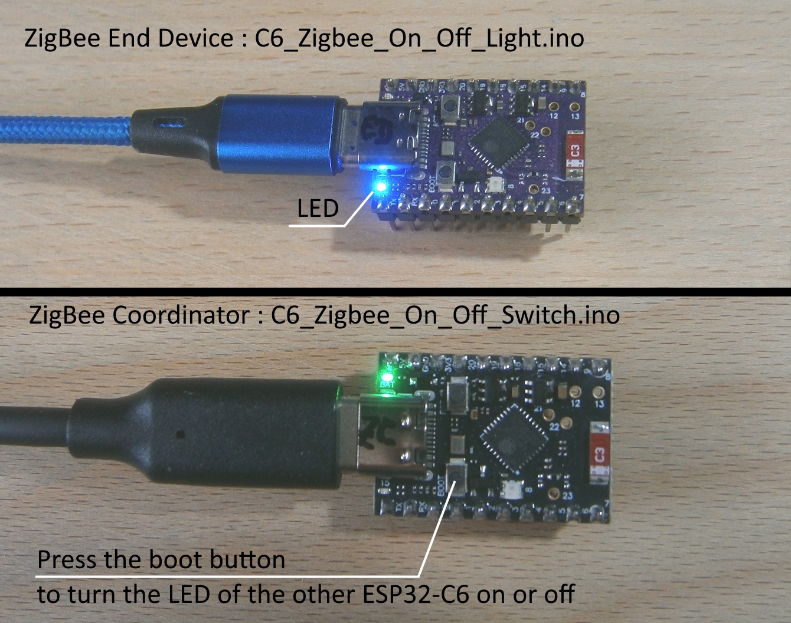
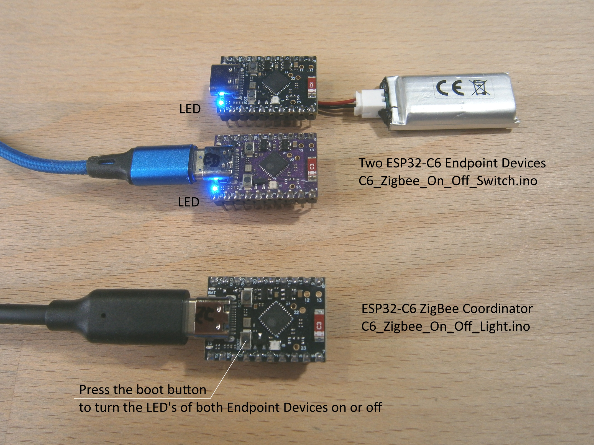

# MakerGO ESP32 C6 SuperMini, esp32 board package 3.3.11 and a ST7789 SPI display 76x284

A similar test with an **ESP32-C5 DevKit V2.0** can be found in the folder [ESP32_C5](../ESP32_C5_DevKit_V2.0/README.md).

A similar test with an **ESP32-P4 WT9932P4** can be found in the folder [ESP32_P4_WT9932P4](../ESP32_P4_WT9932P4/README.md).

A cheap Aliexpress display, tested with an MakerGO ESP32-C6 SuperMini, Arduino IDE 2.3.10 and a modified TFT_eSPI 2.5.43 .

**Board Package :** esp32 3.3.11

**Arduino IDE Board :** MakerGO ESP32 C6 SuperMini

**USB CDC On Boot :** Enabled


ESP32-C6 Super Mini with display 76x284, ST7789.

## Connections for ESP32 C6 SuperMini and ST7789 displays


Pinout ESP32-C6 Super Mini. **RGB-LED : Use virtual pin 39 for digitalWrite() or neopixelWrite()**

| GPIO      | TFT   | Description          |
| --------: | :---- | :------------------- |
|         4 | CS    | CS                   |
|         5 | SDA   | MOSI                 |
|         6 | ---   | MISO  ( not used )   |
|         7 | SCL   | SCLK                 |
|        14 | DC    | DC                   |
|         9 | RST   | Reset                |
|        18 | BLK   | Backlight PWM pin    |
|           | VCC   | 3.3V                 |
|           | GND   | GND                  |

## Configuring the TFT_eSPI

The configuration is done in the files [Arduino/libraries/Setup428_C6_SM_ST7789_76x284.h](Arduino/libraries/Setup428_C6_SM_ST7789_76x284.h) and [Arduino/libraries/TFT_eSPI/User_Setup_Select.h](Arduino/libraries/TFT_eSPI/User_Setup_Select.h).

```java

// ST7789 76x284

// !!!!!!!!!!!!!! Use the modified ST7789_Rotation.h for display 76x284 !!!!!!!!!!!!!!

#define USER_SETUP_ID 428

#define ST7789_DRIVER

#define TFT_WIDTH  76
#define TFT_HEIGHT 284

#define CGRAM_OFFSET

#define TFT_INVERSION_OFF
//#define TFT_BACKLIGHT_ON 1

//#define TFT_BL   18
#define TFT_MISO    6
#define TFT_MOSI    5
#define TFT_SCLK    7
#define TFT_CS      4 
#define TFT_DC     14
#define TFT_RST     9   // Set TFT_RST to -1 if display RESET is connected to ESP32 board EN

#define LOAD_GLCD
#define LOAD_FONT2
#define LOAD_FONT4
#define LOAD_FONT6
#define LOAD_FONT7
#define LOAD_FONT8
#define LOAD_GFXFF

#define SMOOTH_FONT 

#define SPI_FREQUENCY  80000000
```

## Modifying the TFT_eSPI

Copy or replace all files from the [libraries](Arduino/libraries/) directory, including its subdirectories. These are the only modified ( or added) files of the original TFT_eSPI 2.5.43 library, needed for the test programs.

The file [TFT_eSPI.zip](Arduino/TFT_eSPI.zip) contains the complete library files of the TFT_eSPI library, including all configuration files i have.

These files also support the NV3007 display, [ESP32-C5](../ESP32_C5_DevKit_V2.0/README.md) and [ESP32-P4](../ESP32_P4_WT9932P4/README.md).

## Test programs

All files can be found above in the folder [Arduino](Arduino/).

- [Arduino/ESP32_C6_SuperMini_TFT_graphicstest_76x284](Arduino/ESP32_C6_SuperMini_TFT_graphicstest_76x284/ESP32_C6_SuperMini_TFT_graphicstest_76x284.ino) 
- [Arduino/Pins_ESP32_C6_SM.ino](Arduino/Pins_ESP32_C6_SM/Pins_ESP32_C6_SM.ino)

## Battery soldered to the ESP32-C6 SuperMini


ESP32-C6 Super Mini with battery soldered.

## Zigbee examples

Zigbee test programs :
- [Arduino/C6_Zigbee_On_Off_Light](Arduino/C6_Zigbee_On_Off_Light/C6_Zigbee_On_Off_Light.ino) 
- [Arduino/C6_Zigbee_On_Off_Switch.ino](Arduino/C6_Zigbee_On_Off_Switch/C6_Zigbee_On_Off_Switch.ino)


Two ESP32-C6 Super Mini with Zigbee examples.


Three ESP32-C6 Super Mini with zigbee examples.

Before Compile/Verify the C6_Zigbee_On_Off_**Switch**.ino (**ZCZR** here ZC = Zigbee Coordinator) :
- Before Compile/Verify, select the correct board: `Tools -> Board`.
- Select the Coordinator Zigbee mode: `Tools -> Zigbee mode: Zigbee ZCZR (coordinator/router)`.
- Select Partition Scheme for Zigbee: `Tools -> Partition Scheme: Zigbee 4MB with spiffs`.
- Select the COM port: `Tools -> Port: xxx where the `xxx` is the detected COM port.
- **Optional**: Set debug level to verbose to see all logs from Zigbee stack: `Tools -> Core Debug Level: Verbose`.

Before Compile/Verify the C6_Zigbee_On_Off_**Light**.ino (**ED** = End Device) :
- Before Compile/Verify, select the correct board: `Tools -> Board`.
- Select the End device Zigbee mode: `Tools -> Zigbee mode: Zigbee ED (end device)`
- Select Partition Scheme for Zigbee: `Tools -> Partition Scheme: Zigbee 4MB with spiffs`
- Select the COM port: `Tools -> Port: xxx` where the `xxx` is the detected COM port.
- **Optional**: Set debug level to verbose to see all logs from Zigbee stack: `Tools -> Core Debug Level: Verbose`.
