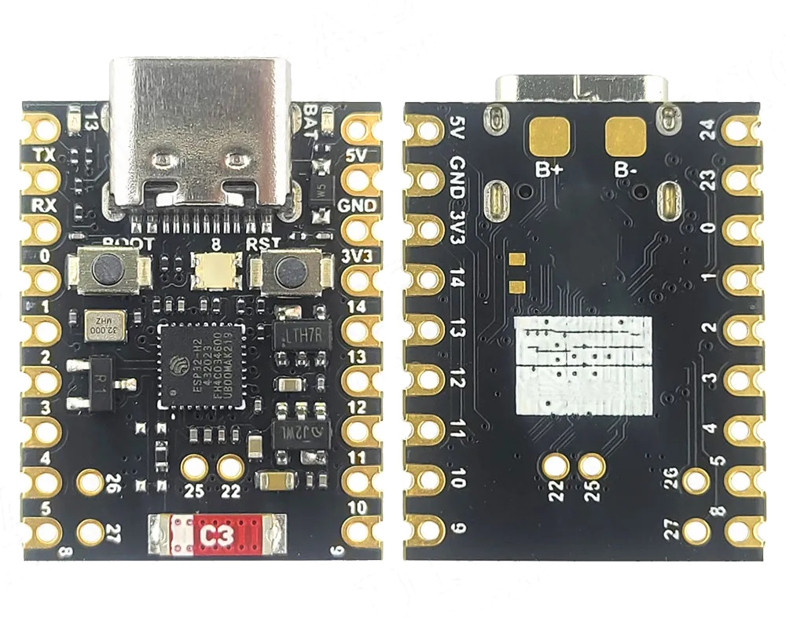
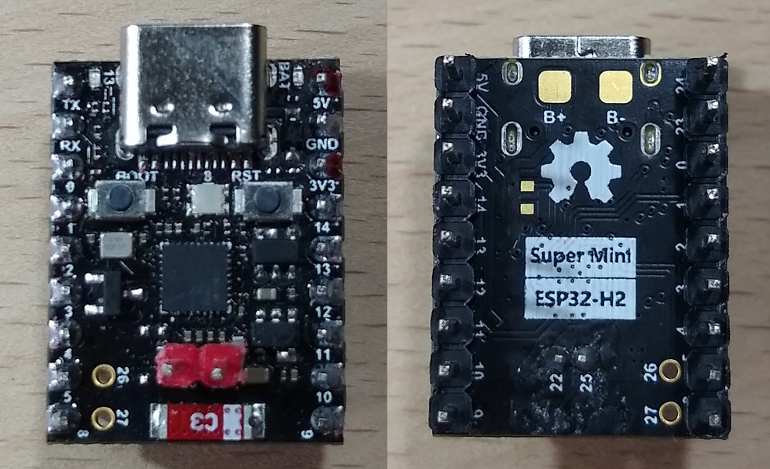
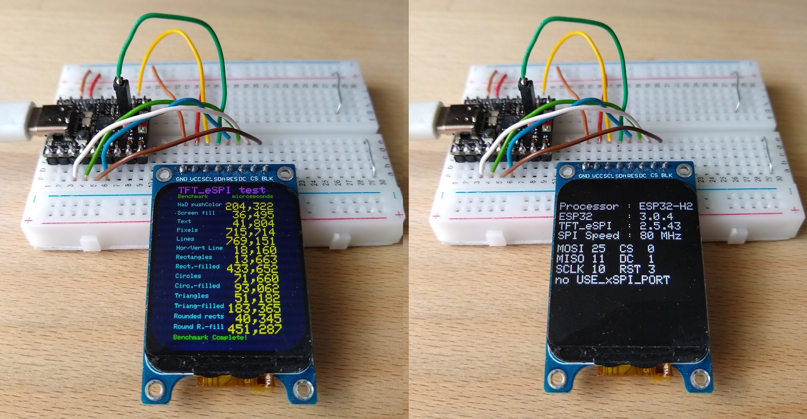
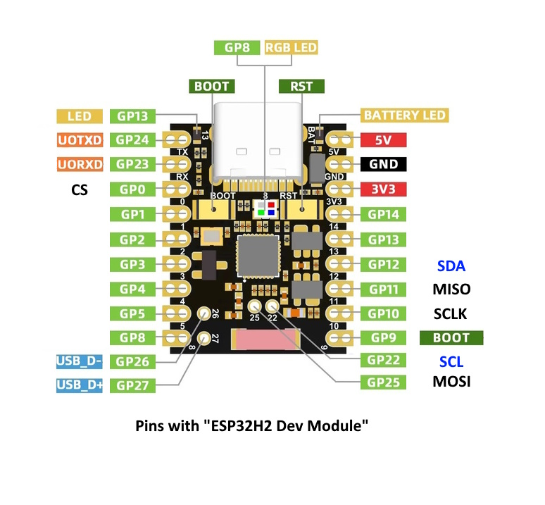

# !!! UNDER CONSTRUCTION !!!

# ESP32-H2 Super Mini and esp32 board package 3.0.4 and four ST7789 SPI displays

Cheap Aliexpress displays, tested with an ESP32-H2 Super Mini, Arduino IDE 2.3.2 and a modified TFT_eSPI 2.5.43 .

**Board Package :** esp32 3.0.4

**Arduino IDE Board :** ESP32-H2 Dev Module

**USB CDC On Boot :** Enabled

**Upload problem :** 
  - Method 1: Press and hold BOOT while connecting. 
  - Method 2: Press and hold the BOOT button then press the RESET button.

All four IPS displays worked stable at 80MHz (40MHz).


ESP32-H2 Super Mini





Benchmark with the display 240x280


## Connections for nanoESP32-H2 Super Mini and all ST7789 IPS displays

| GPIO      | TFT   | Description          |
| --------: | :---- | :------------------- |
|         0 | CS    | CS                   |
|        25 | SDA   | MOSI                 |
|        11 | ---   | MISO  ( not used )   |
|        10 | SCL   | SCLK                 |
|         1 | DC    | DC                   |
|         3 | RST   | Reset                |
|         2 | BLK   | 3.3V or PWM-Pin      |
|           | VCC   | 3.3V                 |
|           | GND   | GND                  |


Pinout ESP32-H2 Super Mini

## Configuring the TFT_eSPI

Edit or copy the setup file [Setup434_H2_ST7789_170x320.h](Arduino/libraries/Setup434_H2_ST7789_170x320.h) or
  [Setup435_H2_ST7789_240x280.h](Arduino/libraries/Setup435_H2_ST7789_240x280.h) or [Setup436_H2_ST7789_240x320.h](Setup436_H2_ST7789_240x320.h) or [Setup437_H2_ST7789_240x240.h](Setup437_H2_ST7789_240x240.h) :
```java

#define USER_SETUP_ID 434 // 435 // 436 // 437

// Driver
#define ST7789_DRIVER     // Configure all registers

#define TFT_WIDTH  170    // 240 // 240 // 240
#define TFT_HEIGHT 320    // 280 // 320 // 240

//#define TFT_RGB_ORDER TFT_BGR  // only for display 240x320 
//#define TFT_INVERSION_ON       // only for display 240x320

//Pins ESP32-H2
#define TFT_CS      0
#define TFT_MOSI   25
#define TFT_MISO   11
#define TFT_SCLK   10
#define TFT_DC      1
#define TFT_RST     3   // Set TFT_RST to -1 if display RESET is connected to ESP32 board EN
//#define TFT_BL    2   // LED backlight

#define LOAD_GLCD
#define LOAD_FONT2
#define LOAD_FONT4
#define LOAD_FONT6
#define LOAD_FONT7
#define LOAD_FONT8
//#define LOAD_FONT8N
#define LOAD_GFXFF

#define SMOOTH_FONT 

//#define SPI_FREQUENCY  20000000
//#define SPI_FREQUENCY  27000000  // same speed as with 20MHz
//#define SPI_FREQUENCY  40000000
#define SPI_FREQUENCY  80000000    // same speed as with 40MHz

//#define SPI_READ_FREQUENCY  20000000
//#define SPI_TOUCH_FREQUENCY  2500000
//#define SUPPORT_TRANSACTIONS
```

Edit or copy the file [User_Setup_Select.h](Arduino/libraries/TFT_eSPI/User_Setup_Select.h)

## Modifying the TFT_eSPI

The ESP32-H2 and ESP32-C6 are an upgraded ESP32-C3, so the code of the library TFT_eSPI works here too (but slower).

Four files were modified to verify this :
- [TFT_eSPI.h](Arduino/libraries/TFT_eSPI/TFT_eSPI.h)
- [TFT_eSPI.cpp](Arduino/libraries/TFT_eSPI/TFT_eSPI.cpp)
- [Processors/TFT_eSPI_ESP32_C3.h](Arduino/libraries/TFT_eSPI/Processors/TFT_eSPI_ESP32_C3.h)
- [Processors/TFT_eSPI_ESP32_C3.c](Arduino/libraries/TFT_eSPI/Processors/TFT_eSPI_ESP32_C3.c)

## Test programs

All files can be found above in the folder Arduino.

- [Arduino/ESP32_H2_TFT_graphicstest_170x320.ino](Arduino/ESP32_H2_TFT_graphicstest_170x320/ESP32_H2_TFT_graphicstest_170x320.ino) 
- [Arduino/ESP32_H2_TFT_graphicstest_240x280.ino](Arduino/ESP32_H2_TFT_graphicstest_240x280/ESP32_H2_TFT_graphicstest_240x280.ino)
- [Arduino/ESP32_H2_TFT_graphicstest_240x320.ino](Arduino/ESP32_H2_TFT_graphicstest_240x320/ESP32_H2_TFT_graphicstest_240x320.ino)
- [Arduino/ESP32_H2_TFT_graphicstest_240x240.ino](Arduino/ESP32_H2_TFT_graphicstest_240x240/ESP32_H2_TFT_graphicstest_240x240.ino)


