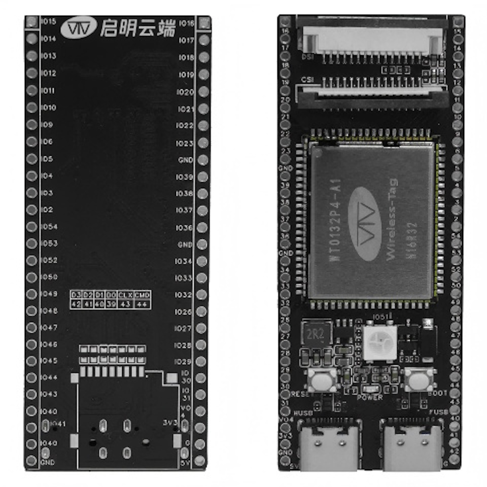
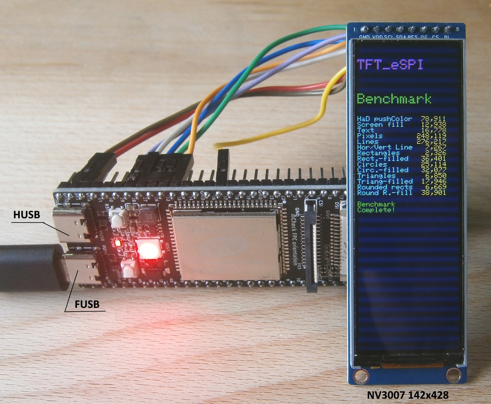
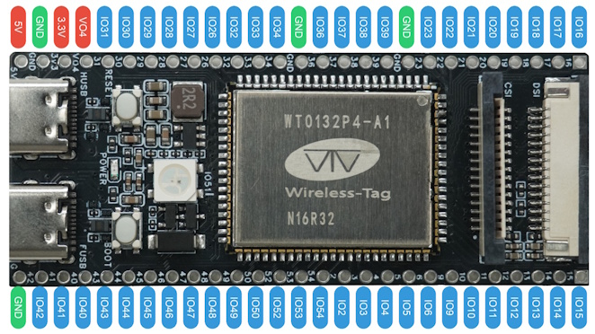
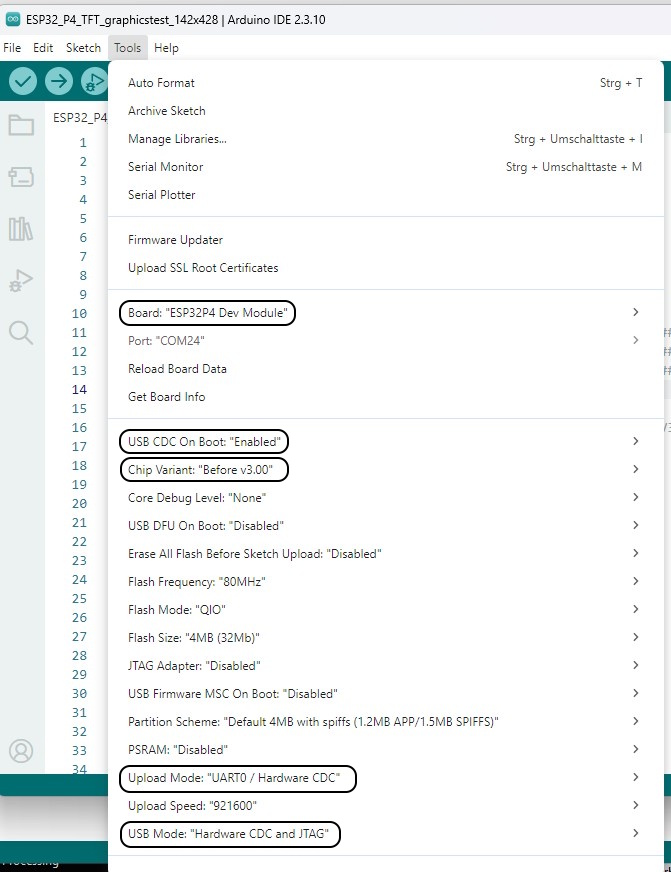

# ESP32-P4 WT9932P4-TINY, esp32 board package 3.3.11 and a NV3007 SPI display 142x428

A similar test with an **ESP32-C5 DevKit V2.0** can be found in the folder [ESP32_C5](../ESP32_C5_DevKit_V2.0/README.md).

A cheap Aliexpress display, tested with an ESP32-P4 WT9932P4-TINY, Arduino IDE 2.3.10 and a modified TFT_eSPI 2.5.43 .

**Board Package :** esp32 3.3.11

**Arduino IDE Board :** "ESP32P4 Dev Module" (Many options and it supports PSRAM)

**USB CDC On Boot :** "Enabled" (Necessary for serial monitor on FUSB)

**Chip Variant :** "Before v3.00" (default , "v3.00 or newer" crashed)

**Upload Mode :** "UART0 / Hardware CDC" (Necessary for serial monitor on FUSB)

**USB Mode :** "Hardware CDC and JTAG" (Necessary for serial monitor on FUSB)

**For uploading programs connect the Board to the FUSB connector.**  

Wireless-Tag ESP32-P4 WT9932P4-TINY

ESP32-P4 WT9932P4-TINY with Display **NV3007** 142x428

## Connections for ESP32 C6 SuperMini and ST7789 displays

ESP32-P4 WT9932P4-TINY Pinout **The RGB-LED is connected to pin 51**

| GPIO      | TFT   | Description          |
| --------: | :---- | :------------------- |
|        26 | CS    | CS                   |
|        32 | SDA   | MOSI                 |
|        33 | ---   | MISO  ( not used )   |
|        36 | SCL   | SCLK                 |
|        27 | DC    | DC                   |
|        28 | RST   | Reset                |
|        29 | BLK   | Backlight PWM-Pin    |
|           | VCC   | 3.3V                 |
|           | GND   | GND                  |

Tools Menu ESP32P4 Dev Module

# Choosing the Arduino IDE Board and the options in the tools menu

The "ESP32P4 Dev Module" seems to be the best choice for the **WT9932P4-TINY** from wireless-tag as long as there is no correct board definition. It is the only one, that supports PSRAM and has partition schemes up to 32MB (256Mb).

The **Chip Variant** must be "Before v3.00".

Don't forget to change **USB CDC On Boot**, **Upload Mode** and **USB Mode** or the serial monitor output goes to the HUSB connector of the board.

There are no pin definitions for the RGB LED in the "ESP32P4 Dev Module". Adding them manually didn't help, so instead of digitalWrite() i had to use rgbLedWrite() or neopixelWrite() (  [ESP32_P4_WT9932P4_Pins.ino](Arduino/ESP32_P4_WT9932P4_Pins/ESP32_P4_WT9932P4_Pins.ino) ) or use the Adafruit library ( [ESP32_P4_WT9932P4_NeoPixel.ino](Arduino/ESP32_P4_WT9932P4_NeoPixel/ESP32_P4_WT9932P4_NeoPixel.ino) ).

## Modifying and configuring the TFT_eSPI

Copy or replace all files from the [libraries](Arduino/libraries/) directory, including its subdirectories. These are only the modified ( or added ) files of ( to ) the original TFT_eSPI 2.5.43 library, needed for the test programs.

The file [TFT_eSPI.zip](Arduino/TFT_eSPI.zip) contains the complete library files of the TFT_eSPI library, including all configuration files i have.

These files also support the NV3007 display, [ESP32-C5](../ESP32_C5_DevKit_V2.0/README.md) and [ESP32-P4](../ESP32_P4_WT9932P4/README.md).

## Test programs

All files can be found above in the folder [Arduino](Arduino/).

- [Arduino/ESP32_P4_TFT_graphicstest_142x428](Arduino/ESP32_P4_TFT_graphicstest_142x428/ESP32_P4_TFT_graphicstest_142x428.ino) 
- [Arduino/ESP32_P4_WT9932P4_Pins.ino](Arduino/ESP32_P4_WT9932P4_Pins/ESP32_P4_WT9932P4_Pins.ino)
- [Arduino/ESP32_P4_WT9932P4_NeoPixel](Arduino/ESP32_P4_WT9932P4_NeoPixel/ESP32_P4_WT9932P4_NeoPixel.ino) 

## Speed comparison 
 
The table indicates that the SPI bus operates at a frequency of 80 MHz ("#define SPI_FREQUENCY  80000000") or 40MHz ("#define SPI_FREQUENCY  40000000").

|                        | ESP32-P4 | ESP32-P4 | ESP32-C5 |
| :--------------------- | -------: | -------: | -------: |
| SPI Frequency          | **80MHz**| **40MHz**| **40MHz**|
|                        |          |          |          |
| Benchmark              |Time in µs|Time in µs|Time in µs|
| HaD pushColor          |    78931 |   146629 |   127591 |
| Screen fill            |    12938 |    25334 |    21632 |
| Text                   |    16810 |    22255 |    21641 |
| Pixels                 |   248119 |   328884 |   344776 |
| Lines                  |   276226 |   377715 |   383880 |
| Horiz/Vert Lines       |     7261 |    12525 |    10385 |
| Rectangles (outline)   |     2327 |     3870 |     3343 |
| Rectangles (filled)    |    36393 |    70934 |    60506 |
| Circles (filled)       |    32109 |    47858 |    44954 |
| Circles (outline)      |    25139 |    33579 |    33428 |
| Triangles (outline)    |     6846 |     9293 |     9216 |
| Triangles (filled)     |    17937 |    30399 |    27515 |
| Rounded rects (outline)|     6696 |     9315 |     8698 |
| Rounded rects (filled) |    38907 |    73996 |    63773 |

**Power consumption** of the WT9932P4-TINY is about 50mA at 5V, when running the NV3007 display.

## Running SPI displays with 80MHz clock speed

\*Most of ESP32's peripheral signals have a direct connection to their dedicated IO_MUX pins. However, the signals can also be routed to any other available pins using the less direct GPIO matrix. If at least one signal is routed through the GPIO matrix, then all signals will be routed through it.

\*The GPIO matrix introduces flexibility of routing but also brings the following disadvantages:
- Increases the input delay of the MISO signal, which makes MISO setup time violations more likely. If SPI needs to operate at high speeds, use dedicated IO_MUX pins.
- Allows signals with clock frequencies only up to 40MHz, as opposed to 80MHz if IO_MUX pins are used.

That seems to be different with the **ESP32-P4** and **ESP32-S31**.

| Pin \ ESP32 |   C6*|C5,C3,C2*|  C61*|   H2*|S3,S2*|   P4*|  P4**|  S31*|ESP32*|  ESP32*|
| :---------- | ---: |    ---: | ---: | ---: | ---: | ---: | ---: | ---: | ---: |   ---: |
| CS          |   16 |      10 |    8 |    1 |   10 |   7* | 28** |  N/A |   15 |      5 |
| SCLK        |    6 |       6 |    6 |    4 |   12 |   9* | 30** |  N/A |   14 |     18 |
| MISO        |    2 |       2 |    2 |    0 |   13 |  10* | 31** |  N/A |   12 |     19 |
| MOSI        |    7 |       7 |    7 |    5 |   11 |   8* | 29** |  N/A |   13 |     23 |
| QUADWP      |    5 |       5 |    4 |    2 |   14 |  11* | 33** |  N/A |   11 |     22 |
| QUADHD      |    4 |       4 |    3 |    3 |    9 |   6* | 32** |  N/A |    6 |     21 |
|-------------|      |         |      |      |      |      |      |      |      |        |
| SPI Bus     | SPI2 |    SPI2 | SPI2 | SPI2 | SPI2 | SPI2 | SPI2 | SPI2 | SPI2 |**SPI3**|

\* Found in the Espressif online documentation https://docs.espressif.com/projects/esp-idf/en/v6.1/esp32p4/api-reference/peripherals/spi_master.html.

\** The [esp32-p4_datasheet_en.pdf](documents/esp32-p4_datasheet_en.pdf) shows additional pins.

In this test with the WT9932P4-TINY the display runs at 80MHz although different pins were used (CS 26, MOSI 32, MISO 33, SCLK 36).
