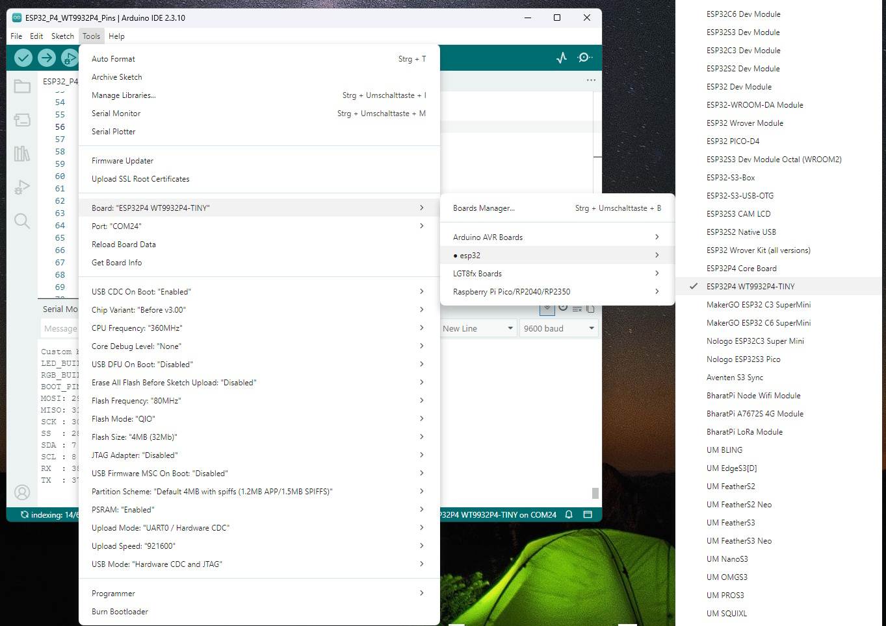

# New Board definition for Wireless-Tag WT9932P4-TINY



## How to add a new board definition and variant

The file "boards.txt" has to be modified and "variants\esp32p4_wt9932p4_tiny\pins_arduino.h" has to be added. If your esp32 board package version is "3.3.11" the files can be found here :

```java
AppData\Local\Arduino15\packages\esp32\hardware\esp32\3.3.11\boards.txt
AppData\Local\Arduino15\packages\esp32\hardware\esp32\3.3.11\variants\esp32p4_wt9932p4_tiny\pins_arduino.h
```

**Before starting :**
- **Don't** copy [boards.txt](boards.txt) if you don't have esp32 board package version "3.3.11" !!!
- **Don't** forget to backup your original "boards.txt".
- Remember all changes are lost after esp32 Board Package is updated !!!

When we edit the file, we can move the most frequently used ones to the top. This ends the annoying scrolling. Furthermore, we can set the options by changing the order of the entries.

**Afterwards :**
- Reload the board.txt in the Arduino IDE Menu : Tools/Reload Board Data
- Restart Arduino IDE

## Changes in boards.txt

You can see the differences if you compare [boards.txt](boards.txt) and [boards.txt.orginal](boards.txt.orginal) of the esp32 board package version "3.3.11".

All changes are done (or moved to) after "esp32p4_core_board" and before "aventen_s3_sync".

```java
## ...
esp32p4_core_board.menu.EraseFlash.all.upload.erase_cmd=-e

##############################################################

esp32p4_wt9932p4_tiny.name=ESP32P4 WT9932P4-TINY

## ...

## build.variant and build.board changed
esp32p4_wt9932p4_tiny.build.variant=esp32p4_wt9932p4_tiny
esp32p4_wt9932p4_tiny.build.chip_variant=esp32p4_es
esp32p4_wt9932p4_tiny.build.board=ESP32P4_WT9932P4_TINY

## ...

## Order changed !!!
esp32p4_wt9932p4_tiny.menu.PSRAM.enabled=Enabled
esp32p4_wt9932p4_tiny.menu.PSRAM.enabled.build.defines=-DBOARD_HAS_PSRAM
esp32p4_wt9932p4_tiny.menu.PSRAM.disabled=Disabled
esp32p4_wt9932p4_tiny.menu.PSRAM.disabled.build.defines=

## Order changed !!!
esp32p4_wt9932p4_tiny.menu.USBMode.hwcdc=Hardware CDC and JTAG
esp32p4_wt9932p4_tiny.menu.USBMode.hwcdc.build.usb_mode=1
esp32p4_wt9932p4_tiny.menu.USBMode.default=USB-OTG (TinyUSB)
esp32p4_wt9932p4_tiny.menu.USBMode.default.build.usb_mode=0

## Order changed !!!
esp32p4_wt9932p4_tiny.menu.CDCOnBoot.cdc=Enabled
esp32p4_wt9932p4_tiny.menu.CDCOnBoot.cdc.build.cdc_on_boot=1
esp32p4_wt9932p4_tiny.menu.CDCOnBoot.default=Disabled
esp32p4_wt9932p4_tiny.menu.CDCOnBoot.default.build.cdc_on_boot=0
## ...

## Added but not tested !!!
## From https://docs.espressif.com/projects/esp-idf/en/latest/esp32p4/api-reference/kconfig.html#config-esp-default-cpu-freq-mhz
esp32p4_wt9932p4_tiny.menu.CPUFreq.360=360MHz
esp32p4_wt9932p4_tiny.menu.CPUFreq.360.build.f_cpu=360000000L
esp32p4_wt9932p4_tiny.menu.CPUFreq.40=40MHz
esp32p4_wt9932p4_tiny.menu.CPUFreq.40.build.f_cpu=40000000L
## ...
##############################################################

## makergo_c3_supermini was moved here  !!!

makergo_c3_supermini.name=MakerGO ESP32 C3 SuperMini
## ...

##############################################################

## makergo_c6_supermini was moved here  !!!

makergo_c6_supermini.name=MakerGO ESP32 C6 SuperMini
## ...

## Added !!!
makergo_c6_supermini.menu.ZigbeeMode.ed_debug=Zigbee ED (end device) - Debug
makergo_c6_supermini.menu.ZigbeeMode.ed_debug.build.zigbee_mode=-DZIGBEE_MODE_ED
makergo_c6_supermini.menu.ZigbeeMode.ed_debug.build.zigbee_libs=-lesp_zb_api.ed.debug -lzboss_stack.ed.debug -lzboss_port.native.debug
makergo_c6_supermini.menu.ZigbeeMode.zczr_debug=Zigbee ZCZR (coordinator/router) - Debug
makergo_c6_supermini.menu.ZigbeeMode.zczr_debug.build.zigbee_mode=-DZIGBEE_MODE_ZCZR
makergo_c6_supermini.menu.ZigbeeMode.zczr_debug.build.zigbee_libs=-lesp_zb_api.zczr.debug -lzboss_stack.zczr.debug -lzboss_port.native.debug

##############################################################

## nologo_esp32c3_super_mini was moved here  !!!

nologo_esp32c3_super_mini.name=Nologo ESP32C3 Super Mini
## ...

##############################################################

## nologo_esp32s3_pico was moved here  !!!

nologo_esp32s3_pico.name=Nologo ESP32S3 Pico
## ...

##############################################################

aventen_s3_sync.name=Aventen S3 Sync
## ...
```

## Using the RGB-LED with digitalWrite() 

With the new board "ESP32 WT9932P4-TINY" we can use digitalWrite() for the RGB-LED.

```java
  digitalWrite(LED_BUILTIN, HIGH);
```  

This can be seen in [ESP32_P4_WT9932P4_Pins.ino](Arduino/ESP32_P4_WT9932P4_Pins/ESP32_P4_WT9932P4_Pins.ino) 

This works because of the changes in "pins_arduino.h" :

```java
#define PIN_RGB_LED 51

// BUILTIN_LED can be used in new Arduino API digitalWrite() like in Blink.ino
static const uint8_t LED_BUILTIN = SOC_GPIO_PIN_COUNT + PIN_RGB_LED;
#define BUILTIN_LED LED_BUILTIN  // backward compatibility
#define LED_BUILTIN LED_BUILTIN  // allow testing #ifdef LED_BUILTIN

// RGB_BUILTIN and RGB_BRIGHTNESS can be used in new Arduino API rgbLedWrite()
#define RGB_BUILTIN    LED_BUILTIN
#define RGB_BRIGHTNESS 64

//...
```
