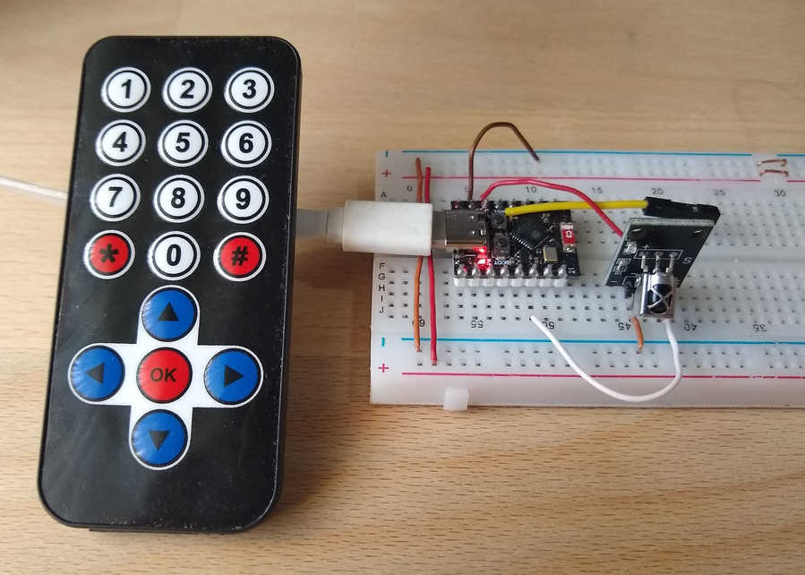
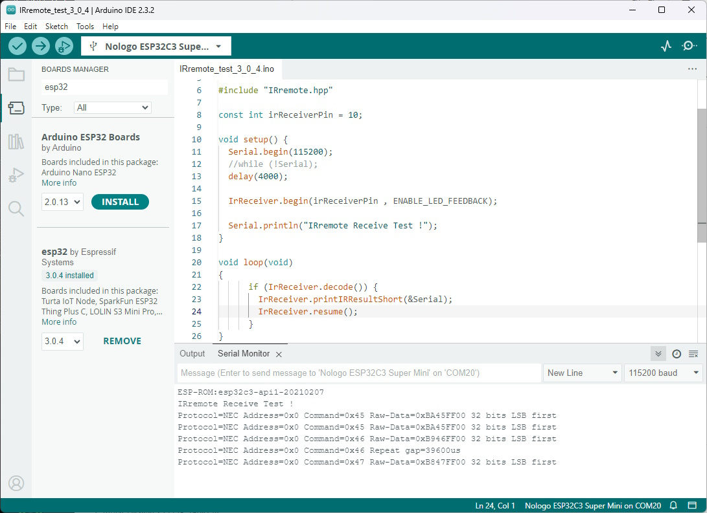

# !!! UNDER CONSTRUCTION !!!

# ESP32-C3 Super Mini, esp32 board package 3.0.4 and IRremote

Testing a modified IRremote library with an ESP32-C3 Super Mini.

**Board Package :** esp32 3.0.4

**IRremoteESP8266 :** Version 4.4.0 (modified)

**Arduino IDE 2.3.2**
- **Board :** "Nologo ESP32-C3 Super Mini" or "ESP32-C3 Dev Module"
- **USB CDC On Boot :** Enabled (for serial monitor)
- **Upload problem :** 
  - Method 1: Press and hold BOOT while connecting. 
  - Method 2: Press and hold the BOOT button then press the RESET button.


ESP32-C3 Super Mini with IR Receiver Module.


Results in Arduino IDE 2.3.2 ( Error is fixed now ! )

## Connections for ESP32-C3 Super Mini and ST7789 IPS displays

| GPIO      | IR    | Description    |
| --------: | :---- | :------------- |
|        10 | Out   | IR Receiver    |
|           | VCC   | 3.3V           |
|           | GND   | GND            |


Arduino IDE Board : "Nologo ESP32C3 Super Mini" or "ESP32C3 Dev Module", USB CDC On Boot : Enabled


## Modifying the library IRremote version 4.4.0

Install the library IRremote 4.4.0 and replace 
```
C:\Users\<username>\Documents\Arduino\libraries\IRremote\src\private\IRTimer.hpp
```
with this file :
- [IRTimer.hpp](Arduino/libraries/IRremote/src/private/IRTimer.hpp)

or download this IRTimer.hpp from Commit [b737e83](https://github.com/Arduino-IRremote/Arduino-IRremote/blob/b737e8323a3b3e0fe8209cbfb8af566fb0c5e251)

https://github.com/Arduino-IRremote/Arduino-IRremote/blob/b737e8323a3b3e0fe8209cbfb8af566fb0c5e251/src/private/IRTimer.hpp


