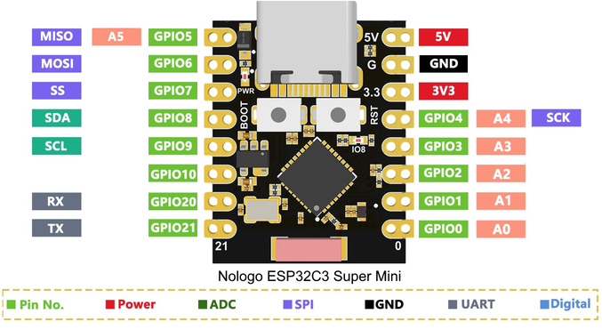

# !!! UNDER CONSTRUCTION !!!

# ESP32-C3 Super Mini, esp32 board package 3.0.4 and IRremote

Testing a modified IRremote library with an ESP32-C3 Super Mini.

**Board Package :** esp32 3.0.4

**IRremoteESP8266 :** Version 4.4.0 (modified)

**Arduino IDE 2.3.2**
- **Board :** "Nologo ESP32-C3 Super Mini" or "ESP32-C3 Dev Module"
- **USB CDC On Boot :** Enabled (for serial monitor)
- **Upload problem :** 
  - Method 1: Press and hold BOOT while connecting. 
  - Method 2: Press and hold the BOOT button then press the RESET button.


ESP32-C3 Super Mini with IR Receiver Module.


Results in Arduino IDE 2.3.2

## Connections for ESP32-C3 Super Mini and ST7789 IPS displays

| GPIO      | IR    | Description    |
| --------: | :---- | :------------- |
|        10 | Out   | IR Receiver    |
|           | VCC   | 3.3V           |
|           | GND   | GND            |


Arduino IDE Board : "Nologo ESP32C3 Super Mini" or "ESP32C3 Dev Module", USB CDC On Boot : Enabled


## Modifying the library IRremote version 4.4.0

Install the library IRremote and replace 
```
C:\Users\<username>\Documents\Arduino\libraries\IRremote\src\private\IRTimer.hpp
```
with this file :
- [IRTimer.hpp](Arduino/libraries/IRremote/src/private/IRTimer.hpp)

## The modified part of IRTimer.hpp starts at line 1449

The modified code is marked with //?//

```java
...

#  if ESP_ARDUINO_VERSION < ESP_ARDUINO_VERSION_VAL(3, 0, 0)     //?//
void timerEnableReceiveInterrupt() {
    timerAlarmEnable(s50usTimer);
}
#  else                                                          //?//
void timerEnableReceiveInterrupt() {                             //?//
    timerRestart(s50usTimer);                                    //?//
}                                                                //?//
#  endif                                                         //?//

#  if !defined(ESP_ARDUINO_VERSION)
#define ESP_ARDUINO_VERSION 0
#  endif
#  if !defined(ESP_ARDUINO_VERSION_VAL)
#define ESP_ARDUINO_VERSION_VAL(major, minor, patch) 202
#  endif
#  if ESP_ARDUINO_VERSION < ESP_ARDUINO_VERSION_VAL(2, 0, 2)
void timerDisableReceiveInterrupt() {
    if (s50usTimer != NULL) {
        timerDetachInterrupt(s50usTimer);
        timerEnd(s50usTimer);
    }
}
#  elif ESP_ARDUINO_VERSION < ESP_ARDUINO_VERSION_VAL(3, 0, 0)   //?//
void timerDisableReceiveInterrupt() {
    if (s50usTimer != NULL) {
        timerAlarmDisable(s50usTimer);
    }
}
#  else                                                          //?//
void timerDisableReceiveInterrupt() {                            //?//
    timerStop(s50usTimer);                                       //?//
}                                                                //?//
#  endif                                                         //?//

// Undefine ISR, because we register/call the plain function IRReceiveTimerInterruptHandler()
#  if defined(ISR)
#undef ISR
#  endif

#  if !defined(DISABLE_CODE_FOR_RECEIVER) // &IRReceiveTimerInterruptHandler is referenced, but not available

#    if ESP_ARDUINO_VERSION < ESP_ARDUINO_VERSION_VAL(3, 0, 0)              //?//
void timerConfigForReceive() {
    // ESP32 has a proper API to setup timers, no weird chip macros needed
    // simply call the readable API versions :)
    // 3 timers, choose #1, 80 divider for microsecond precision @80MHz clock, count_up = true
    if(s50usTimer == NULL) {
        s50usTimer = timerBegin(1, 80, true);
        timerAttachInterrupt(s50usTimer, &IRReceiveTimerInterruptHandler, false); // false -> level interrupt, true -> edge interrupt, but this is not supported :-(
        timerAlarmWrite(s50usTimer, MICROS_PER_TICK, true);
    }
    // every 50 us, autoreload = true
}
#    else                                                                   //?//
void timerConfigForReceive() {                                              //?//
    if(s50usTimer == NULL) {                                                //?//
        s50usTimer = timerBegin(1000000);                                   //?//
        timerAttachInterrupt(s50usTimer, &IRReceiveTimerInterruptHandler);  //?//
        timerAlarm(s50usTimer, MICROS_PER_TICK, true, 0);                   //?//
    }                                                                       //?//
}                                                                           //?//
#    endif                                                                  //?//
#  endif

...

```

## Tested with

- [Arduino/IRremote_test_3_0_4.ino](Arduino/IRremote_test_3_0_4/IRremote_test_3_0_4.ino) 


