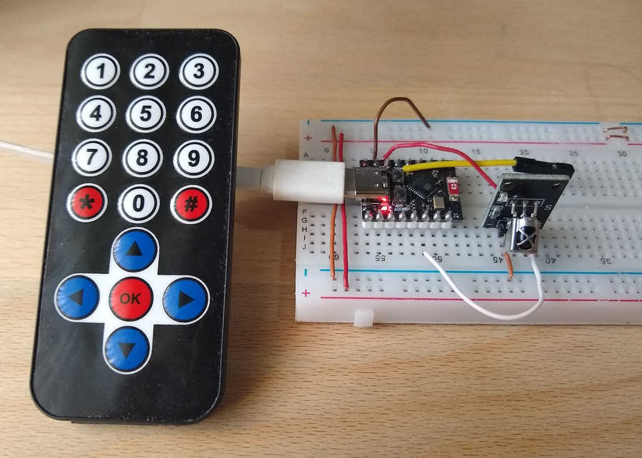
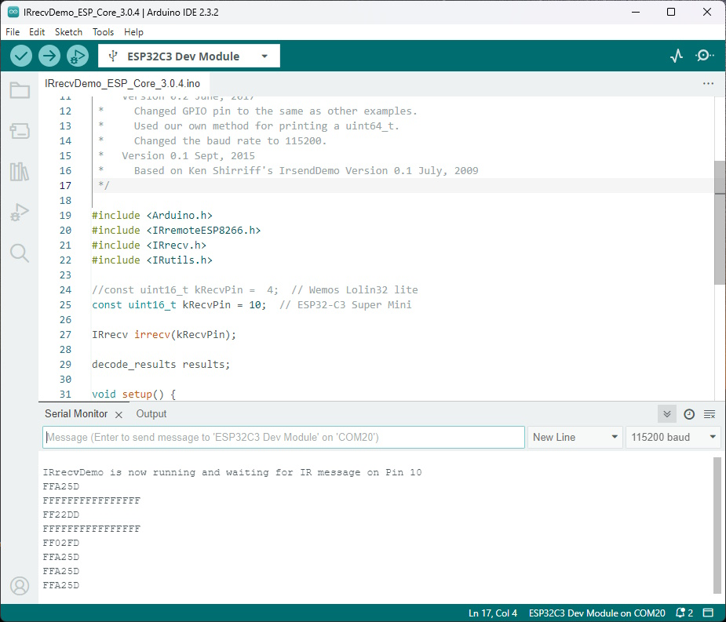

# !!! UNDER CONSTRUCTION !!!

# ESP32-C3 Super Mini, esp32 board package 3.0.4 and IRremoteESP8266

Testing a modified IRremoteESP8266 library with an ESP32-C3 Super Mini and a Wemos Lolin32 lite.

**Board Package :** esp32 3.0.4

**IRremoteESP8266 :** Version 2.8.6 (modified)

**Arduino IDE 2.3.2**
- **Board :** "Nologo ESP32-C3 Super Mini" or "ESP32-C3 Dev Module"
- **USB CDC On Boot :** Enabled (for serial monitor)
- **Upload problem :** 
  - Method 1: Press and hold BOOT while connecting. 
  - Method 2: Press and hold the BOOT button then press the RESET button.


ESP32-C3 Super Mini with IR Receiver Module.


Results in Arduino IDE 2.3.2

## Connections for ESP32-C3 Super Mini and ST7789 IPS displays

| GPIO      | IR    | Description    |
| --------: | :---- | :------------- |
|        10 | Out   | IR Receiver    |
|           | VCC   | 3.3V           |
|           | GND   | GND            |


Arduino IDE Board : "Nologo ESP32C3 Super Mini" or "ESP32C3 Dev Module", USB CDC On Boot : Enabled

## Modifying esp32-hal-timer.h and esp32-hal-timer.c

Edit or copy the modified files [esp32-hal-timer.h](esp32-hal-timer/esp32-hal-timer.h) and [esp32-hal-timer.c](esp32-hal-timer/esp32-hal-timer.c) .

The files can be found in this directory :

```
C:\Users\<username>\AppData\Local\Arduino15\packages\esp32\hardware\esp32\3.0.4\cores\esp32\
```
In the file esp32-hal-timer.h add the line

```
bool timerStarted(hw_timer_t *timer);
```

In the file esp32-hal-timer.c add this lines

```
bool timerStarted(hw_timer_t *timer) {
  return timer->timer_started;
}
```
## Modifying the library IRremoteESP8266 version 2.8.6

Install the library and replace these four files :
- [IRrecv.cpp](Arduino/libraries/IRremoteESP8266/src/IRrecv.cpp)
- [IRrecv.h](Arduino/libraries/IRremoteESP8266/src/IRrecv.h)
- [IRremoteESP8266.h](Arduino/libraries/IRremoteESP8266/src/IRremoteESP8266.h)
- [IRutils.cpp](Arduino/libraries/IRremoteESP8266/src/IRutils.cpp)

## Changes in IRrecv.cpp

Base were the commits [9cfcebc](https://github.com/crankyoldgit/IRremoteESP8266/commit/9cfcebc3a6a8d913d3b15ceea10e7e3ef4a798b5) and [db98aa0](https://github.com/crankyoldgit/IRremoteESP8266/commit/9cfcebc3a6a8d913d3b15ceea10e7e3ef4a798b5) .

In the file IRrecv.cpp i replaced in gpio_intr()

```java
#if ( defined(ESP_ARDUINO_VERSION_MAJOR) && (ESP_ARDUINO_VERSION_MAJOR >= 3) )
  timerWrite(timer, 0);
  timerStart(timer);
```
with

```java
#if ( defined(ESP_ARDUINO_VERSION_MAJOR) && (ESP_ARDUINO_VERSION_MAJOR >= 3) )
  timerWrite(timer, 0);
  if (timerStarted(timer))   //?//
    timerRestart(timer);     //?//
  else                       //?//
    timerStart(timer);
```
and in IRrecv::resume

```java
#if ( defined(ESP_ARDUINO_VERSION_MAJOR) && (ESP_ARDUINO_VERSION_MAJOR >= 3) )
  timerStop(timer);
```
with
```java
#if ( defined(ESP_ARDUINO_VERSION_MAJOR) && (ESP_ARDUINO_VERSION_MAJOR >= 3) )
  if (timerStarted(timer))    //?//
    timerStop(timer);
```

## Tested with

- [Arduino/IRrecvDemo_ESP_Core_3.0.4.ino](Arduino/IRrecvDemo_ESP_Core_3.0.4/IRrecvDemo_ESP_Core_3.0.4.ino) 
