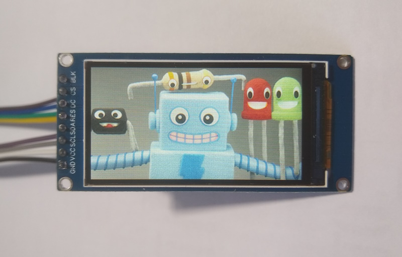
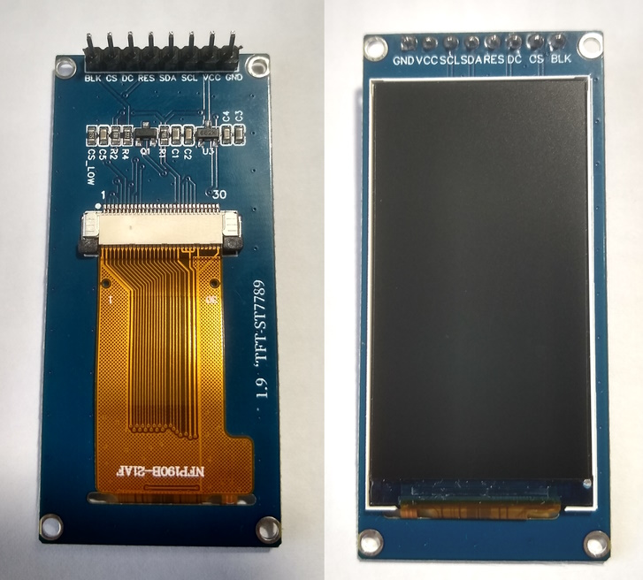
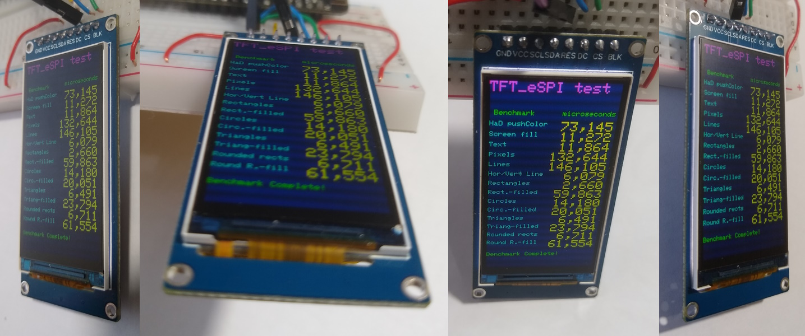
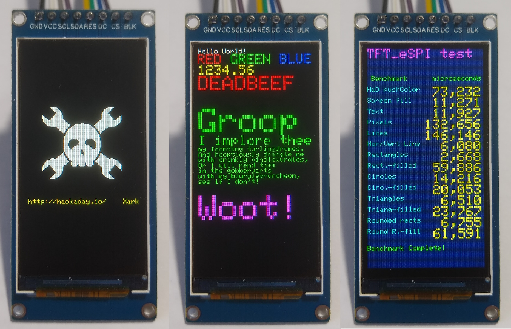

# !!! UNDER construction !!!

# Three IPS Displays with ST7789 170x320 and 240x280 and 240x320, same connector

Aliexpress Display between 2€ and 5€, tested with a ESP32 Wemos lite, Arduino IDE 2.3.2 and TFT_eSPI 2.5.43.

Arduino IDE Board : "WEMOS LOLIN32 Lite"

All three displays work stable with 80MHz even with a 50cm long cable between ESP32 and display.

Speed (40MHz/80MHz) : Bouncy_Circles 45/85fps, boing_ball 105/135fps, Sprite_Rotating 153/305fps.

| Test               | 170x320 | 240x280 | 240x320 |
| :----------------- | ------: | ------: | ------: |
| Bouncy_Circles     |  88 fps |  73 fps |  65 fps |
| boing_ball         | 134 fps | 133 fps | 136 fps |
| SpriteRotatingCube | 303 fps | 303 fps | 303 fps |
| Power Consumption  |  34 mA  |  41 mA  |  48 mA  |





The display is easy to read from different angles.



[Arduino\TFT_graphicstest_PDQ.ino](Arduino/TFT_graphicstest_170x320/TFT_graphicstest_170x320.ino) ( modified )




[Arduino\Bouncy_Circles.ino](Arduino/Bouncy_Circles/Bouncy_Circles.ino) and [Arduino\SpriteRotatingCube.ino](Arduino/SpriteRotatingCube/SpriteRotatingCube.ino) and [Arduino\boing_ball.ino](Arduino/boing_ball/boing_ball.ino) ( not modified )


[Arduino\show_pictures.ino](Arduino/show_pictures/show_pictures.ino) 


## Connections for Wemos Lolin32 lite 

| GPIO | TFT   | Description         |
| ---: | :---- | :------------------ |
| 23   | SDA   | MOSI Hardware SPI   |
| 18   | SCK   | CLK  Hardware SPI   |
|  5   | CS    | CS                  |
| 17   | DC    | DC                  |
| EN   | RES   | Reset               |
|      | BLK   | 3.3V ( or PWM-Pin ) |
|      | VCC   | 3.3V                |
|      | GND   | GND                 |

## Configure the library TFT_eSPI

Edit the file [Arduino\libraries\TFT_eSPI\User_Setup_Select.h](Arduino/libraries/TFT_eSPI/User_Setup_Select.h )

```java
// Only **ONE** line below should be uncommented to define your setup.

//#include <User_Setup.h>                // Default setup is root library folder

// new setup file in folder Arduino/libraries, so updates will not overwrite your setups.
#include <../Setup407_ST7789_320x170.h>  // new setup file for  ST7789 170x320 
```
Create a new file [Arduino\libraries\Setup407_ST7789_320x170.h](Arduino/libraries/Setup407_ST7789_320x170.h) 

```java
#define USER_SETUP_ID 407

// Driver
#define ST7789_DRIVER          // Configure all registers
#define TFT_WIDTH  170
#define TFT_HEIGHT 320
#define TFT_INVERSION_ON
#define TFT_BACKLIGHT_ON 1

#define TFT_RGB_ORDER TFT_BGR  // !!! Only for Display 240x320 !!!

// Pins
#define TFT_BL     -1          // 16  // LED backlight
#define TFT_MISO   -1          // Not connected
#define TFT_MOSI   23
#define TFT_SCLK   18
#define TFT_CS      5 
#define TFT_DC     17
#define TFT_RST    -1          // Set TFT_RST to -1 if display RESET is connected to ESP32 board EN

// Fonts
#define LOAD_GLCD
#define LOAD_FONT2
#define LOAD_FONT4
#define LOAD_FONT6
#define LOAD_FONT7
#define LOAD_FONT8
//#define LOAD_FONT8N
#define LOAD_GFXFF
#define SMOOTH_FONT

// Other options
//#define SPI_READ_FREQUENCY    20000000
//#define SPI_FREQUENCY         40000000
#define SPI_FREQUENCY         80000000

```
## Test programs

All files can be found above in the folder Arduino.

- [Arduino\TFT_graphicstest_170x320.ino](Arduino/TFT_graphicstest_170x320/TFT_graphicstest_170x320.ino) ( modified )
- [Arduino\show_pictures.ino](Arduino/show_pictures/show_pictures.ino) 
- [Arduino\boing_ball.ino](Arduino/boing_ball/boing_ball.ino) ( not modified )
- [Arduino\Bouncy_Circles.ino](Arduino/Bouncy_Circles/Bouncy_Circles.ino) ( not modified )
- [Arduino\SpriteRotatingCube.ino](Arduino/SpriteRotatingCube/SpriteRotatingCube.ino) ( not modified )
 
