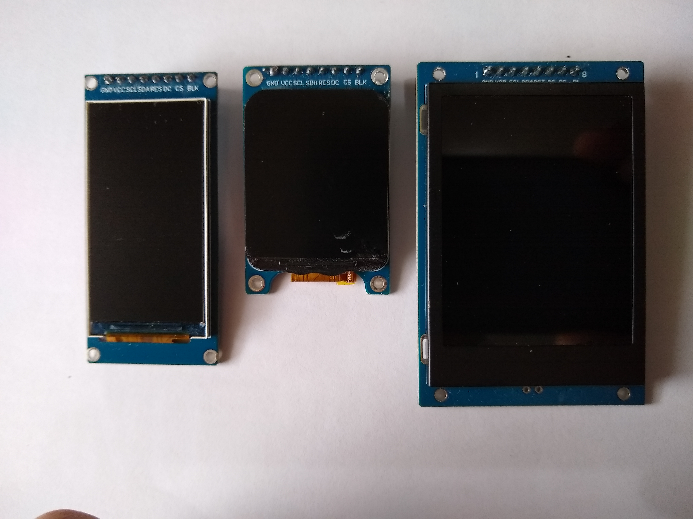
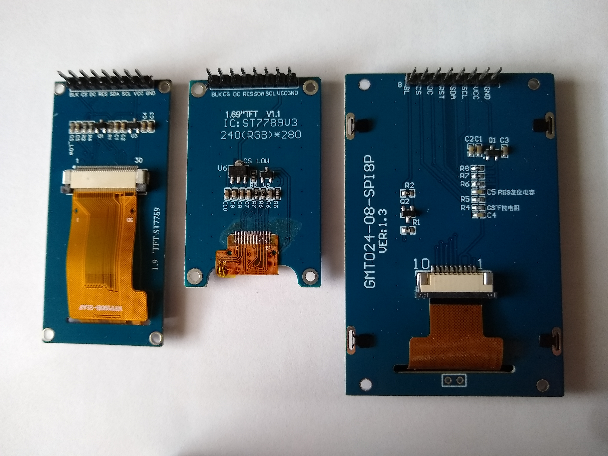
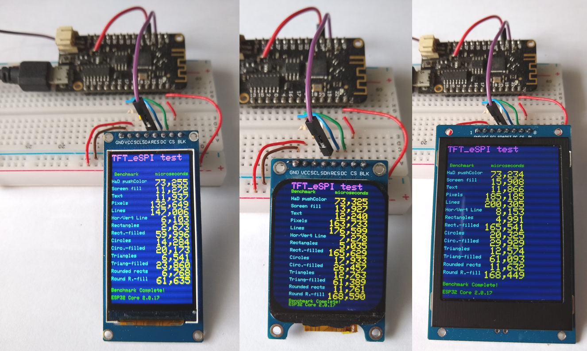
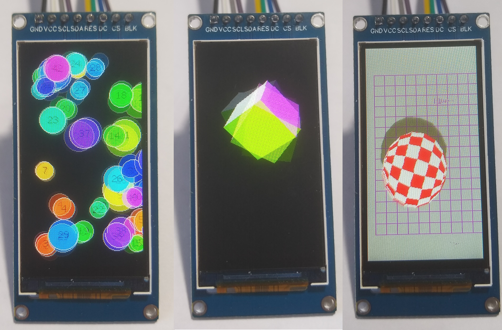
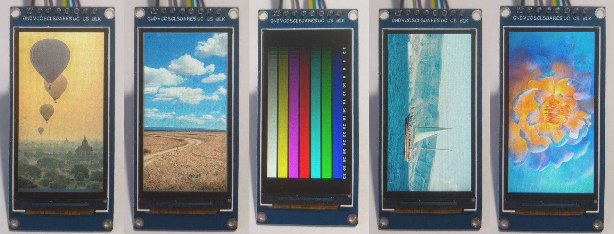

# Three IPS Displays with ST7789. Same 8 pin connector
## Resolution 170x320, 240x280 and 240x320 

Aliexpress Displays between 2€ and 5€, tested with  ESP32 Wemos lite, Arduino IDE 2.3.2 and TFT_eSPI 2.5.43.

Arduino IDE Board : "WEMOS LOLIN32 Lite"

All three displays work stable with 80MHz, even with a 50cm long cable between ESP32 and display. 

Similar tests but with a RP2040 (ESP32-S2, S3, C3, C6, H2) and more displays can be found in the folders [RP2040](RP2040/README.md) , [ESP32_S2](ESP32_S2) , [ESP32_S3](ESP32_S3) , [ESP32_C3](ESP32_C3/README.md), [ESP32_C3_Super_Mini](ESP32_C3_Super_Mini) , [ESP32_C6](ESP32_C6/README.md) and  [ESP32_H2](ESP32_H2/README.md).

| Test               | 170x320 | 240x280 | 240x320 |
| :----------------- | ------: | ------: | ------: |
| Bouncy_Circles     |  88 fps |  73 fps |  65 fps |
| boing_ball         | 134 fps | 133 fps | 136 fps |
| SpriteRotatingCube | 303 fps | 303 fps | 303 fps |
| Display Surface    |   matte |   matte |  glossy |
| Power Consumption  |  34 mA  |  41 mA  |  48 mA  |



Front



Back



- [Arduino/TFT_graphicstest_170x320.ino](Arduino/TFT_graphicstest_170x320/TFT_graphicstest_170x320.ino) ( modified )
- [Arduino/TFT_graphicstest_240x280.ino](Arduino/TFT_graphicstest_240x280/TFT_graphicstest_240x280.ino) ( modified )
- [Arduino/TFT_graphicstest_240x320.ino](Arduino/TFT_graphicstest_240x320/TFT_graphicstest_240x320.ino) ( modified )



[Arduino/Bouncy_Circles.ino](Arduino/Bouncy_Circles/Bouncy_Circles.ino) and [Arduino/SpriteRotatingCube.ino](Arduino/SpriteRotatingCube/SpriteRotatingCube.ino) and [Arduino/boing_ball.ino](Arduino/boing_ball/boing_ball.ino) ( not modified )



- [Arduino/show_pictures_170x320.ino](Arduino/show_pictures_170x320/show_pictures_170x320.ino)  
- [Arduino/show_pictures_240x280.ino](Arduino/show_pictures_240x280/show_pictures_240x280.ino)  
- [Arduino/show_pictures_240x320.ino](Arduino/show_pictures_240x320/show_pictures_240x320.ino)  


## Connections for Wemos Lolin32 lite 

| GPIO | TFT   | Description         |
| ---: | :---- | :------------------ |
| 23   | SDA   | MOSI Hardware SPI   |
| 18   | SCK   | CLK  Hardware SPI   |
|  5   | CS    | CS                  |
| 17   | DC    | DC                  |
| EN   | RES   | Reset               |
|      | BLK   | 3.3V ( or PWM-Pin ) |
|      | VCC   | 3.3V                |
|      | GND   | GND                 |

## Configure the library TFT_eSPI

Edit the file [Arduino/libraries/TFT_eSPI/User_Setup_Select.h](Arduino/libraries/TFT_eSPI/User_Setup_Select.h )

```java
// Only **ONE** line below should be uncommented to define your setup.

//#include <User_Setup.h>                // Default setup is root library folder

// new setup file in folder Arduino/libraries, so updates will not overwrite your setups.
#include <../Setup407_ST7789_320x170.h>  // new setup file for  ST7789 170x320 
//#include <../Setup408_ST7789_280x240.h>  // new setup file for  ST7789 240x280 
//#include <../Setup409_ST7789_320x240.h>  // new setup file for  ST7789 240x320 
```
Create the new files :
- [Arduino\libraries\Setup407_ST7789_320x170.h](Arduino/libraries/Setup407_ST7789_320x170.h)
- [Arduino\libraries\Setup408_ST7789_280x240.h](Arduino/libraries/Setup408_ST7789_280x240.h) 
- [Arduino\libraries\Setup409_ST7789_320x240.h](Arduino/libraries/Setup409_ST7789_320x240.h) 

```java
#define USER_SETUP_ID 407

// Driver
#define ST7789_DRIVER            // Configure all registers
#define TFT_WIDTH  170
#define TFT_HEIGHT 320
#define TFT_INVERSION_ON
#define TFT_BACKLIGHT_ON 1

//#define TFT_RGB_ORDER TFT_BGR  // !!! Only for Display 240x320 !!!

// Pins
#define TFT_BL     -1            // 16  // LED backlight
#define TFT_MISO   -1            // Not connected
#define TFT_MOSI   23
#define TFT_SCLK   18
#define TFT_CS      5 
#define TFT_DC     17
#define TFT_RST    -1            // Set TFT_RST to -1 if display RESET is connected to ESP32 board EN

// Fonts
#define LOAD_GLCD
#define LOAD_FONT2
#define LOAD_FONT4
#define LOAD_FONT6
#define LOAD_FONT7
#define LOAD_FONT8
//#define LOAD_FONT8N
#define LOAD_GFXFF
#define SMOOTH_FONT

// Other options
//#define SPI_READ_FREQUENCY    20000000
//#define SPI_FREQUENCY         40000000
#define SPI_FREQUENCY         80000000

```
## Test programs

All files can be found above in the folder Arduino.

Setup :
- [Arduino/libraries/Setup407_ST7789_320x170.h](Arduino/libraries/Setup407_ST7789_320x170.h)
- [Arduino/libraries/Setup408_ST7789_280x240.h](Arduino/libraries/Setup408_ST7789_280x240.h) 
- [Arduino/libraries/Setup409_ST7789_320x240.h](Arduino/libraries/Setup409_ST7789_320x240.h) 
- [Arduino/libraries/TFT_eSPI/User_Setup_Select.h](Arduino/libraries/TFT_eSPI/User_Setup_Select.h )

Benchmark :
- [Arduino/TFT_graphicstest_170x320.ino](Arduino/TFT_graphicstest_170x320/TFT_graphicstest_170x320.ino) ( modified )
- [Arduino/TFT_graphicstest_240x280.ino](Arduino/TFT_graphicstest_240x280/TFT_graphicstest_240x280.ino) ( modified )
- [Arduino/TFT_graphicstest_240x320.ino](Arduino/TFT_graphicstest_240x320/TFT_graphicstest_240x320.ino) ( modified )

Show Pictures :
- [Arduino/show_pictures_170x320.ino](Arduino/show_pictures_170x320/show_pictures_170x320.ino)  
- [Arduino/show_pictures_240x280.ino](Arduino/show_pictures_240x280/show_pictures_240x280.ino)  
- [Arduino/show_pictures_240x320.ino](Arduino/show_pictures_240x320/show_pictures_240x320.ino)  

Original TFT_eSPI Examples :
- boing_ball.ino
- Bouncy_Circles.ino
- SpriteRotatingCube.ino
- TFT_graphicstest_PDQ    ( for Display 240x320 )
 
