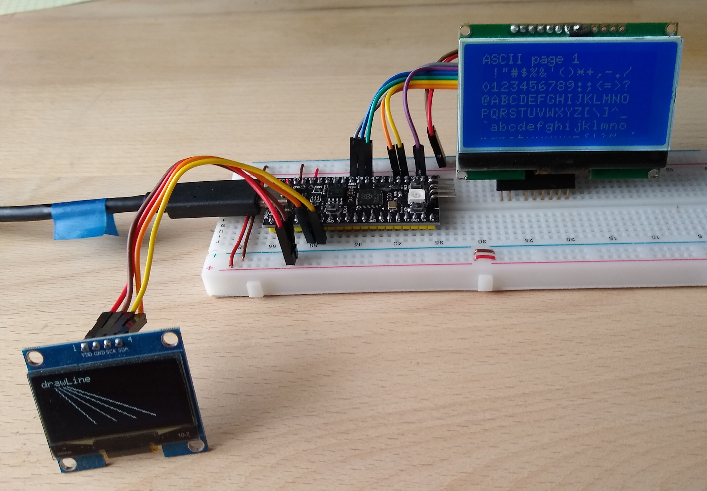

# !!!! Under construction !!!

# Three IPS Displays with ST7789 and YD RP2040.

Three Aliexpress Displays between 2€ and 5€, tested with an YD RP2040 about 2-3€, Arduino IDE 2.3.2 and TFT_eSPI 2.5.43.

Boards Manager : Raspberry Pi Pico/RP2040 by Earle F. Philhower, III, v3.93

URL : https://github.com/earlephilhower/arduino-pico/releases/download/global/package_rp2040_index.json

Arduino IDE Board : "VCC-GND YD RP2040"

All three displays worked stable with 62.5MHz (75MHz), if the RP2040 runs with 125MHz (150MHz). Higher frequencies  didn't work or were not stable.


TFT_eSPI graphicstest


## Installation for YD RP2040 by Earle F. Philhower, III, v3.93
Open up the Arduino IDE and go to File->Preferences.

In the dialog that pops up, enter the following URL in the "Additional Boards Manager URLs" field:

https://github.com/earlephilhower/arduino-pico/releases/download/global/package_rp2040_index.json

## Connections for YD RP2040

| GPIO | TFT   |     |Description          |
| ---: | :---- | :-- | :------------------ |
|    4 | SDA   | I2C | SDA                 |
|    5 | CLK   | I2C | SCL                 |
|------|------ |-----|-------------------- |
|   19 | SDA   | SPI | MOSI                |
|  (16)|       | SPI | MISO ( not used )   |
|   18 | SCL   | SPI | CLK                 |
|   17 | CS    | SPI | CS                  |
|   22 | DC    | SPI | DC                  |
|  (26)| BLK   |     | 3.3V ( or PWM-Pin ) |
|   EN | RST   | SPI | Reset               |
|      | VCC   |     | 3.3V                |
|      | GND   |     | GND                 |


The Serial monitor in the program [Arduino\RP2040_WS2812.ino](Arduino/RP2040_WS2812/RP2040_WS2812.ino) shows the pins of the YD RP2040 :

```java
MOSI: 19
MISO: 16
SCK: 18
SS: 17
SDA: 4
SCL: 5
LED_BUILTIN: 25
```

## More Displays


Three I2C-Displays SSD1306 , SSD1306 , SSD1309


SPI-Display GMG12864-06D

- [Arduino\RP2040_u8g2_Displays_Graphics_Test.ino](Arduino/RP2040_u8g2_Displays_Graphics_Test/RP2040_u8g2_Displays_Graphics_Test.ino)

```java
// Enable only one of the four display drivers :

U8G2_SSD1306_128X64_NONAME_F_HW_I2C u8g2(U8G2_R0);     // 0.96" mini or 4 button display

//U8G2_SSD1309_128X64_NONAME2_F_HW_I2C u8g2(U8G2_R0);    // 1.3" display, GND und VDD are reversed !!! 

//U8G2_SSD1306_128X32_UNIVISION_F_HW_I2C u8g2(U8G2_R0);  // not tested

// GMG12864 uncomment both lines !!
//U8G2_ST7565_ERC12864_ALT_F_4W_HW_SPI u8g2(U8G2_R0, /* cs=*/ 17, /* dc=*/ 22, /* reset=*/ U8X8_PIN_NONE); 
//#define CONTRAST 75  //  Don't forget this for GMG12864  !!
```

xxx

---
xxx


- [Arduino\RP2040_TFT_graphicstest_170x320.ino](Arduino/RP2040_TFT_graphicstest_170x320/RP2040_TFT_graphicstest_170x320.ino)
- [Arduino\RP2040_TFT_graphicstest_240x280.ino](Arduino/RP2040_TFT_graphicstest_240x280/RP2040_TFT_graphicstest_240x280.ino)
- [Arduino\RP2040_TFT_graphicstest_240x320.ino](Arduino/RP2040_TFT_graphicstest_240x320/RP2040_TFT_graphicstest_240x320.ino)


## Configure the library TFT_eSPI

Edit the file [Arduino\libraries\TFT_eSPI\User_Setup_Select.h](Arduino/libraries/TFT_eSPI/User_Setup_Select.h )

```java
// Only **ONE** line below should be uncommented to define your setup.

//#include <User_Setup.h>                // Default setup is root library folder

// new setup file in folder Arduino/libraries, so updates will not overwrite your setups.
#include <../Setup451_RP2040_ST7789_170x320.h>  // RP2040, ST7789
//#include <../Setup452_RP2040_ST7789_240x280.h>  // RP2040, ST7789
//#include <../Setup453_RP2040_ST7789_240x320.h>  // RP2040, ST7789
```
Create the new files :
- [Arduino\libraries\Setup451_RP2040_ST7789_170x320.h](Arduino/libraries/Setup451_RP2040_ST7789_170x320.h)
- [Arduino\libraries\Setup452_RP2040_ST7789_240x28.h](Arduino/libraries/Setup451_RP2040_ST7789_240x280.h)
- [Arduino\libraries\Setup453_RP2040_ST7789_240x320.h](Arduino/libraries/Setup451_RP2040_ST7789_240x320.h)


```java
#define USER_SETUP_ID 451

// Driver
#define ST7789_DRIVER            // Configure all registers
#define TFT_WIDTH  170
#define TFT_HEIGHT 320
#define TFT_INVERSION_ON
#define TFT_BACKLIGHT_ON 1

//#define TFT_RGB_ORDER TFT_BGR  // !!! Only for Display 240x320 !!!

// The PIO can only be user with Earle Philhower's RP2040 board package:
//   https://github.com/earlephilhower/arduino-pico

// PIO SPI allows high SPI clock rates to be used when the processor is over-clocked.
// PIO SPI is "write only" and the TFT_eSPI touch functions are not supported.
// A touch screen could be used with a third party library on different SPI pins.

// This invokes the PIO based SPI interface for the RP2040 processor.
#define RP2040_PIO_SPI  // Black screen if you forget this line

//Pins RP2040
#define TFT_BL     -1   // LED back-light  // 26
#define TFT_MISO   -1   // Not connected
#define TFT_MOSI   19
#define TFT_SCLK   18
#define TFT_CS     17 
#define TFT_DC     22
#define TFT_RST    -1   // Set TFT_RST to -1 if display RESET is connected to ESP32 board EN

// Fonts
#define LOAD_GLCD
#define LOAD_FONT2
#define LOAD_FONT4
#define LOAD_FONT6
#define LOAD_FONT7
#define LOAD_FONT8
//#define LOAD_FONT8N
#define LOAD_GFXFF
#define SMOOTH_FONT

// Other options
// RP2040 max frequency if f is 125MHz / 2 = 62.5MHz. Take next higher integer.
// #define SPI_FREQUENCY       25000000  // f/2  25.00MHz
// #define SPI_FREQUENCY       32000000  // f/2  31.25MHz
// #define SPI_FREQUENCY       42000000  // f/2  41.67MHz
#define SPI_FREQUENCY       70000000  // f/2  62.50MHz

```
## Test programs

All files can be found above in the folder Arduino.

Setup :
- [Arduino\libraries\Setup407_ST7789_320x170.h](Arduino/libraries/Setup407_ST7789_320x170.h)
- [Arduino\libraries\Setup408_ST7789_280x240.h](Arduino/libraries/Setup408_ST7789_280x240.h) 
- [Arduino\libraries\Setup409_ST7789_320x240.h](Arduino/libraries/Setup409_ST7789_320x240.h) 
- [Arduino\libraries\TFT_eSPI\User_Setup_Select.h](Arduino/libraries/TFT_eSPI/User_Setup_Select.h )

Benchmark :
- [Arduino\TFT_graphicstest_170x320.ino](Arduino/TFT_graphicstest_170x320/TFT_graphicstest_170x320.ino) ( modified )
- [Arduino\TFT_graphicstest_240x280.ino](Arduino/TFT_graphicstest_240x280/TFT_graphicstest_240x280.ino) ( modified )
- [Arduino\TFT_graphicstest_240x320.ino](Arduino/TFT_graphicstest_240x320/TFT_graphicstest_240x320.ino) ( modified )

Show Pictures :
- [Arduino\show_pictures_170x320.ino](Arduino/show_pictures_170x320/show_pictures_170x320.ino)  
- [Arduino\show_pictures_240x280.ino](Arduino/show_pictures_240x280/show_pictures_240x280.ino)  
- [Arduino\show_pictures_240x320.ino](Arduino/show_pictures_240x320/show_pictures_240x320.ino)  

Original TFT_eSPI Examples :
- boing_ball.ino
- Bouncy_Circles.ino
- SpriteRotatingCube.ino
- TFT_graphicstest_PDQ    ( for Display 240x320 )
 

