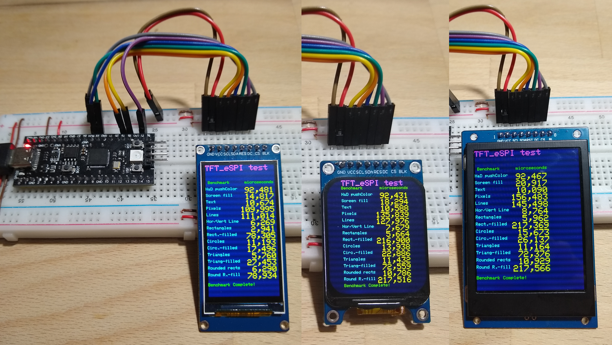
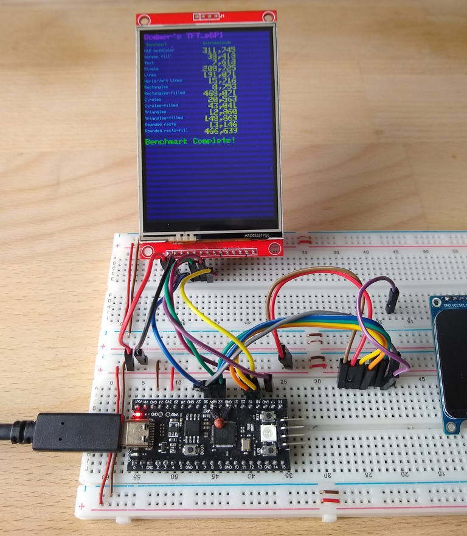

# Eigth displays and YD RP2040.

Eight cheap Aliexpress displays, tested with a YD RP2040, Arduino IDE 2.3.2 and TFT_eSPI 2.5.43 or u8g2 2.34.22

**Board Package :** Raspberry Pi Pico/RP2040 by Earle F. Philhower, III, v3.93

**Arduino IDE Board :** "VCC-GND YD RP2040"

All three IPS displays worked stable at 125MHz (SPI 62.5MHz). **Overclocking** worked at 150MHz (SPI 75MHz) and 240MHz (SPI 80MHz) on all three displays. 


200 MHz (SPI 100 MHz) and 250 MHz (SPI 125 MHz) only worked with the middle display (240 x 280, ST7789v3) and I had to connect the display's RESET pin to  pin 27, not with the pin RUN. Later I changed this back and soldered a **2.2nF capacitor** between RUN and  instead. Several overclocking tests are performed using an ili9488 display (more information below).


TFT_eSPI graphicstest

- [Arduino\RP2040_TFT_graphicstest_170x320.ino](Arduino/RP2040_TFT_graphicstest_170x320/RP2040_TFT_graphicstest_170x320.ino)
- [Arduino\RP2040_TFT_graphicstest_240x280.ino](Arduino/RP2040_TFT_graphicstest_240x280/RP2040_TFT_graphicstest_240x280.ino)
- [Arduino\RP2040_TFT_graphicstest_240x320.ino](Arduino/RP2040_TFT_graphicstest_240x320/RP2040_TFT_graphicstest_240x320.ino)

The programs contains information, which display works with which frequency.

## Install Earle Philhower's RP2040 board package 

Open up the Arduino IDE and go to File->Preferences.
In the dialog that pops up, enter the following URL in the "Additional Boards Manager URLs" field:

- https://github.com/earlephilhower/arduino-pico/releases/download/global/package_rp2040_index.json

Go to Tools->Boards->Board Manager in the IDE. Choose "Raspberry Pi Pico/RP2040" and select "Add".

## RP2040 First use ( and Unbrick )

If the drive "RPI-RP2" doesn't show up, when you connect the RP2040, then press and hold down the BOOT button. Then press RESET. The RPI-RP2 drive should appear. This also works if the RP2040 board is **"bricked"**, i.e. if neither the com port nor the RPI-RP2 drive shows up, which happens more often when overclocking the RP2040 (see below).

Copy the file [SOS.ino.uf2](documents/SOS.ino.uf2) to the RPI-RP2 drive. After uploading the drive disappears and a new COM port shows up. The LED on the RP2040 board is now flashing SOS. 

This file is compiled for the "VCC-GND YD-RP2040" board, so you don't need to change the COM port later, like when using [PicoBlink.ino.uf2](documents/PicoBlink.ino.uf2) or [ flash_nuke. ino.uf2](documents/flash_nuke.ino.uf2), which you can download from the Internet.

If you want to create your own “Blink.ino.uf2”, just compile/upload this program “Blink” using the Arduino IDE. Then search for “Blink.ino.uf2” in your user folder and subfolders. 
- C:\Users\ **your username**\AppData\Local\Temp\arduino\sketches\ **path name**\Blink.ino.uf2"

## Links   

RP2040 Pico clone firmware https://forums.raspberrypi.com/viewtopic.php?t=368305

Factory reset Pico no longer registers com port on windows https://forums.raspberrypi.com/viewtopic.php?t=350680

Bricked MicroPython rescue firmware https://forums.raspberrypi.com/viewtopic.php?f=146&t=305432

Raspberry Pi Pico factory reset https://forum.micropython.org/viewtopic.php?t=10838


The folder [documents](documents) also contains the documentation for the YD RP2040 found here : http://124.222.62.86/yd-data/YD-RP2040/.


## Connections for YD RP2040

| GPIO      | TFT   | Interface |Description           |
| --------: | :---- | :-------- | :------------------- |
|         4 | SDA   | I2C       | SDA                  |
|         5 | CLK   | I2C       | SCL                  |
|-----------|------ |-----------|----------------------|
|        19 | SDA   | SPI       | MOSI                 |
|       (16)|       | SPI       | MISO  ( not used )   |
|        18 | SCL   | SPI       | CLK                  |
|        17 | CS    | SPI       | CS                   |
|        22 | DC    | SPI       | DC                   |
|   RUN (27)| RST   | SPI       | Reset ( or PWM-Pin ) |
|       (26)| BLK   |           | 3.3V  ( or PWM-Pin ) |
|           | VCC   |           | 3.3V                 |
|           | GND   |           | GND                  |

**RESET pin:** It is more stable to use a 2.2nF capacitor between RUN and GND or connect the RST pin to the pin 27 for example (see picture ili9488 below).


The serial monitor in the program [Arduino\RP2040_WS2812.ino](Arduino/RP2040_WS2812/RP2040_WS2812.ino) shows the pins of the YD RP2040 :

```java
MOSI: 19
MISO: 16
SCK: 18
SS: 17
SDA: 4
SCL: 5
LED_BUILTIN: 25
```

## Four monochrome displays

For these displays install the library u8g2 by olikraus.


Three I2C-Displays. Driver : SSD1306 (left), SSD1306 (middle), SSD1309 (right).

**Pay attention** to the VCC and GND pins being swapped on the right display !!!


SPI display GMG12864-06D

The backlight pin of the GMG12864 is connected to an 47 Ohm resistor, which draws about 12mA.

First choose the driver in the file  :
- [Arduino\RP2040_u8g2_Displays_Graphics_Test.ino](Arduino/RP2040_u8g2_Displays_Graphics_Test/RP2040_u8g2_Displays_Graphics_Test.ino) or
- [Arduino\RP2040_u8g2_Displays_Graphics_Test_BL.ino](Arduino/RP2040_u8g2_Displays_Graphics_Test_BL/RP2040_u8g2_Displays_Graphics_Test_BL.ino) ( with backlight dimming test. Only for GMG12864 ) :

```java
// Enable only one of the four display drivers :

U8G2_SSD1306_128X64_NONAME_F_HW_I2C u8g2(U8G2_R0);     // 0.96" mini or 4 button display

//U8G2_SSD1309_128X64_NONAME2_F_HW_I2C u8g2(U8G2_R0);    // 1.3" display, GND und VDD are reversed !!! 

//U8G2_SSD1306_128X32_UNIVISION_F_HW_I2C u8g2(U8G2_R0);  // not tested

// GMG12864 uncomment both lines !!
//U8G2_ST7565_ERC12864_ALT_F_4W_HW_SPI u8g2(U8G2_R0, /* cs=*/ 17, /* dc=*/ 22, /* reset=*/ U8X8_PIN_NONE); 
//#define CONTRAST 75  //  Don't forget this for GMG12864  !!
```
Now you can upload the graphics test program.

## Configure the library TFT_eSPI

Edit or copy the file [Arduino\libraries\TFT_eSPI\User_Setup_Select.h](Arduino/libraries/TFT_eSPI/User_Setup_Select.h )

```java
// Only **ONE** line below should be uncommented to define your setup.

//#include <User_Setup.h>                // Default setup is root library folder

// new setup file in folder Arduino/libraries, so updates will not overwrite your setups.
#include <../Setup451_RP2040_ST7789_170x320.h>  // RP2040, ST7789
//#include <../Setup452_RP2040_ST7789_240x280.h>  // RP2040, ST7789
//#include <../Setup453_RP2040_ST7789_240x320.h>  // RP2040, ST7789

//#include <../Setup454_RP2040_ILI9488_Touch.h>   // RP2040, ili9488
```
Create or copy the new files :
- [Arduino\libraries\Setup451_RP2040_ST7789_170x320.h](Arduino/libraries/Setup451_RP2040_ST7789_170x320.h)
- [Arduino\libraries\Setup452_RP2040_ST7789_240x280.h](Arduino/libraries/Setup451_RP2040_ST7789_240x280.h)
- [Arduino\libraries\Setup453_RP2040_ST7789_240x320.h](Arduino/libraries/Setup451_RP2040_ST7789_240x320.h)
- [Arduino\libraries\Setup454_RP2040_ILI9488_Touch.h](Arduino/libraries/Setup454_RP2040_ILI9488_Touch.h) see below


Now you can run the corresponding benchmark test :
- [Arduino\RP2040_TFT_graphicstest_170x320.ino](Arduino/RP2040_TFT_graphicstest_170x320/RP2040_TFT_graphicstest_170x320.ino)
- [Arduino\RP2040_TFT_graphicstest_240x280.ino](Arduino/RP2040_TFT_graphicstest_240x280/RP2040_TFT_graphicstest_240x280.ino)
- [Arduino\RP2040_TFT_graphicstest_240x320.ino](Arduino/RP2040_TFT_graphicstest_240x320/RP2040_TFT_graphicstest_240x320.ino)
- [Arduino\RP2040_TFT_graphicstest_PDQ.ino](Arduino/RP2040_TFT_graphicstest_PDQ/RP2040_TFT_graphicstest_PDQ.ino) for display 240x320
- [Arduino\RP2040_TFT_graphicstest_PDQ_ili9488.ino](Arduino/RP2040_TFT_graphicstest_PDQ_ili9488/RP2040_TFT_graphicstest_PDQ_ili9488.ino) see below

### Display Configuration file

The line "#define RP2040_PIO_SPI" allows **overclocking** with the Earle Philhower's RP2040 board package and frequencies other than 125 MHz.


```java
#define USER_SETUP_ID 451

// Driver
#define ST7789_DRIVER               // Configure all registers
#define TFT_WIDTH  170
#define TFT_HEIGHT 320
#define TFT_INVERSION_ON
#define TFT_BACKLIGHT_ON 1

//#define TFT_RGB_ORDER TFT_BGR     // !!! Only for Display 240x320 !!!

// The PIO can only be user with Earle Philhower's RP2040 board package:
// https://github.com/earlephilhower/arduino-pico

// PIO SPI allows high SPI clock rates to be used when the processor is over-clocked.
// PIO SPI is "write only" and the TFT_eSPI touch functions are not supported.
// A touch screen could be used with a third party library on different SPI pins.

// This invokes the PIO based SPI interface for the RP2040 processor :
#define RP2040_PIO_SPI   // Faster with all frequencies other than 125MHz, but no touch functions.

//Pins RP2040
#define TFT_BL     -1   // LED back-light  // 26
#define TFT_MISO   -1   // Not connected
#define TFT_MOSI   19
#define TFT_SCLK   18
#define TFT_CS     17 
#define TFT_DC     22
#define TFT_RST    -1   // Set TFT_RST to -1 if display RESET is connected to RP2040 board RUN
//#define TFT_RST    27   // For overclocking, RESET can be connected to pin 27  

// Fonts
#define LOAD_GLCD
#define LOAD_FONT2
#define LOAD_FONT4
#define LOAD_FONT6
#define LOAD_FONT7
#define LOAD_FONT8
//#define LOAD_FONT8N
#define LOAD_GFXFF
#define SMOOTH_FONT

// Other options
// RP2040 max frequency if f is 125MHz / 2 = 62.5MHz. Take next higher integer.

// #define SPI_FREQUENCY  25000000  // 125/5 =  25.00MHz
// #define SPI_FREQUENCY  32000000  // 125/4 =  31.25MHz
// #define SPI_FREQUENCY  42000000  // 125/3 =  41.67MHz
// #define SPI_FREQUENCY  70000000  // 125/2 =  62.50MHz
// #define SPI_FREQUENCY 100000000  // 200/2 = 100.00MHz  Overclocking
   #define SPI_FREQUENCY 125000000  // 250/2 = 125.00MHz  Overclocking

```
# Overclocking test with an ili9488 display

This ili9488 display works stable with an ESP32 S3 at 40MHz, but has issues at 80MHz.

The aim of this test was to find out up to which frequency the ili9488 display works stable. Overclocking and PIO SPI with Earle Philhower's RP2040 board package and TFT_eSPI allows testing multiple SPI frequencies.

The RUN pin is very "sensible". Measuring this pin with a multimeter will reset the RP2040. 

Because of the problems with the RUN pin, I finally soldered a small **capacitor (2.2nF)** between RUN and GND (see picture). This solved many overclocking problems and allowes the RUN pin of the RP2040 to be connected to the RESET pin of the display.

However, it can also be helpful to also connect the display's RST pin to pin 27 instead of RUN.

Overclocking table :

|CPU                     |  RP2040 | RP2040 |   RP2040 | RP2040 | RP2040 | RP2040 |   RP2040 |  RP2040 | ESP32 S3| ESP32 S3|     | 
| :--------------------- | ------: | -----: | -------: | -----: | -----: | -----: | -------: |-------: |-------: |-------: | :-: | 
|CPU Frequency           |    125  |   125  |     133  |   200  |   225  |   240  |     250  |     250 |    240  |    240  | MHz | 
|Divider                 |   125/3 |  125/2 |    133/2 |  200/3 |  225/3 |  240/3 |    250/3 |   250/2 |    80/2 |   80/1  | MHz |
|SPI Frequency           |   41,67 |  62,50 |    66,50 |  66,67 |  75,00 |  80,00 |    83,34 |  125,00 |   40,00 |  80,00  | MHz | 
|Benchmark               |         |        |          |        |        |        |          |         |         |         |     |
|HaD pushColor           |  991385 | 499217 |**468883**| 619425 | 550510 | 516086 |  495483  |  249323 |  860339 |  489737 |  µs |
|Screen fill             |  122907 |  61474 | **57763**|  76812 |  68277 |  64011 |   61450  |   30735 |  105218 |   58648 |  µs |
|Text                    |   18848 |  12250 |   11602  |  12002 |  10628 |   9862 |  **9548**|    6043 |   35456 |   30643 |  µs |
|Pixels                  |  631967 | 335160 |  314888  | 393710 | 350052 | 327912 |**314820**|  166839 | 1519622 | 1383868 |  µs |
|Lines                   |  539284 | 306844 |  288233  | 336136 | 298578 | 279823 |**268578**|  152695 | 1309770 | 1128234 |  µs |
|Horiz/Vert Lines        |   49965 |  25147 | **23613**|  31234 |  27763 |  26026 |   24992  |   12561 |   44977 |   26368 |  µs |
|Rectangles (outline)    |   27594 |  14001 | **13133**|  17253 |  15365 |  14403 |   13818  |    6987 |   25298 |   15088 |  µs |
|Rectangles (filled)     | 1497646 | 748896 |**703862**| 936047 | 832032 | 780038 |  748814  |  374448 | 1282645 | 715384  |  µs |
|Circles (filled)        |  133280 |  69367 | **64902**|  83082 |  73793 |  69194 |   66403  |   34394 |  168811 |  121517 |  µs |
|Circles (outline)       |   58235 |  33090 |   30996  |  36297 |  32243 |  30206 | **28994**|   16421 |  125492 |  108983 |  µs |
|Triangles (outline)     |   31982 |  20649 |   19399  |  19976 |  17738 |  16622 | **15952**|   10272 |   62570 |   52203 |  µs |
|Triangles (filled)      |  473104 | 238287 |**223949**| 295703 | 262837 | 246391 |  236490  |  119019 |  439671 |  263084 |  µs |
|Rounded rects (outline) |   38961 |  21749 |   19741  |  23827 |  21189 |  19826 | **19029**|   10506 |   58080 |   45067 |  µs |
|Rounded rects (filled)  | 1493357 | 748021 |**702346**| 932549 | 828886 | 777132 |  746038  |  373279 | 1290781 |  727830 |  µs |
|Picture ok?             |      ok |     ok |       ok |     ok |     ok |     ok |       ok |**errors**|     ok |**errors**|  µs |

Distortions or errors :
- RP2040 150MHz, SPI  75,00MHz many errors
- RP2040 200MHz, SPI 100,00MHz many errors
- RP2040 225MHz, SPI 112,50MHz some errors
- RP2040 240MHz, SPI 120,00MHz some errors
- RP2040 250MHz, SPI 125,00MHz some errors
- ESP32-S3 240MHz, SPI 80,00MHz many errors

RP2040 "bricked" :
- RP2040 CPU 175MHz SPI  87,50MHz RP2040 "bricked"
- RP2040 CPU 275MHz SPI 137,50MHz RP2040 "bricked"
- RP2040 CPU 300MHz SPI 150,00MHz RP2040 "bricked"

### Connections for YD RP2040 and ili9488

| GPIO      | TFT   | Description |
| --------: | :---- | :---------- |
|        19 | SDA   | MOSI        |
|        18 | SCL   | CLK         |
|        17 | CS    | CS          |
|        22 | DC    | DC          |
|        27 | RST   | Reset       |
|           | BLK   | 3.3V        |
|           | VCC   | 3.3V        |
|           | GND   | GND         |


RP2040 with capacitor 2,2nF and ili9488. Benchmark : [Arduino\RP2040_TFT_graphicstest_PDQ_ili9488.ino](Arduino/RP2040_TFT_graphicstest_PDQ_ili9488/RP2040_TFT_graphicstest_PDQ_ili9488.ino)


ili9488 back view

Same test is done using a ESP32-S3. For versions greater than 2.0.14 of the esp32 board package add the following line to the TFT_eSPI configuration file. 

> #define USE_HSPI_PORT

## Test programs

All files can be found above in the folder [Arduino](Arduino).

Setup :
- [Arduino\libraries\Setup451_RP2040_ST7789_170x320.h](Arduino/libraries/Setup451_RP2040_ST7789_170x320.h)
- [Arduino\libraries\Setup452_RP2040_ST7789_240x280.h](Arduino/libraries/Setup452_RP2040_ST7789_240x280.h) 
- [Arduino\libraries\Setup453_RP2040_ST7789_240x320.h](Arduino/libraries/Setup453_RP2040_ST7789_240x320.h) 
- [Arduino\libraries\Setup454_RP2040_ILI9488_Touch.h](Arduino/libraries/Setup454_RP2040_ILI9488_Touch.h) 

Setup for TFT_eSPI
- [Arduino\libraries\TFT_eSPI\User_Setup_Select.h](Arduino/libraries/TFT_eSPI/User_Setup_Select.h )
- [Arduino\RP2040_WS2812.ino](Arduino/RP2040_WS2812/RP2040_WS2812.ino) 

Benchmark IPS color displays and ili9488 :
- [Arduino\RP2040_TFT_graphicstest_170x320.ino](Arduino/RP2040_TFT_graphicstest_170x320/RP2040_TFT_graphicstest_170x320.ino)
- [Arduino\RP2040_TFT_graphicstest_240x280.ino](Arduino/RP2040_TFT_graphicstest_240x280/RP2040_TFT_graphicstest_240x280.ino)
- [Arduino\RP2040_TFT_graphicstest_240x320.ino](Arduino/RP2040_TFT_graphicstest_240x320/RP2040_TFT_graphicstest_240x320.ino)
- [Arduino\RP2040_TFT_graphicstest_PDQ.ino](Arduino/RP2040_TFT_graphicstest_PDQ/RP2040_TFT_graphicstest_PDQ.ino) for display 240x320
- [Arduino\RP2040_TFT_graphicstest_PDQ_ili9488.ino](Arduino/RP2040_TFT_graphicstest_PDQ_ili9488/RP2040_TFT_graphicstest_PDQ_ili9488.ino)

Benchmark monochrome displays :
- [Arduino\RP2040_u8g2_Displays_Graphics_Test.ino](Arduino/RP2040_u8g2_Displays_Graphics_Test/RP2040_u8g2_Displays_Graphics_Test.ino)
- [Arduino\RP2040_u8g2_Displays_Graphics_Test_BL.ino](Arduino/RP2040_u8g2_Displays_Graphics_Test_BL/RP2040_u8g2_Displays_Graphics_Test_BL.ino)

Original TFT_eSPI examples :
- boing_ball.ino
- Bouncy_Circles.ino
- SpriteRotatingCube.ino
