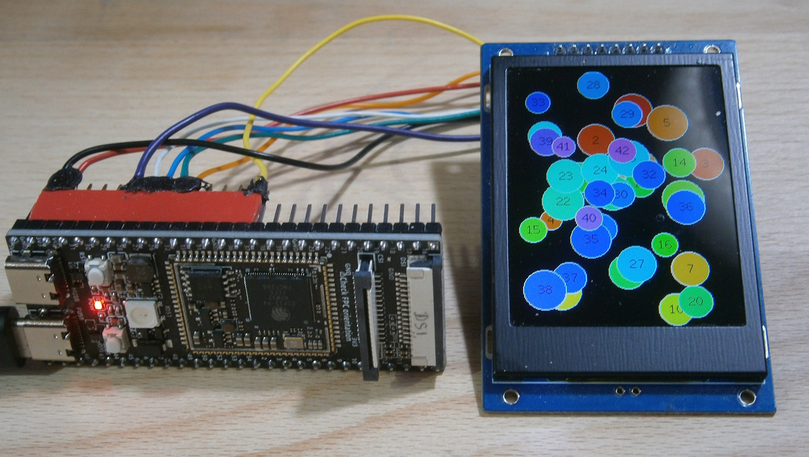

# !!! Under construction !!!

# DMA with TFT_eSPI for ESP32-P4 and ESP32-C5 using SPI Master Pins


ESP32-P4 WT9932P4-TINY, display 240x320 and Bouncy_Circles_8.ino

1. ESP32-C3/C6/S2/S3 class targets only support auto-allocated DMA channel or ESP32-XX crashes. 

2. DMA buffer is smaller (32768), so Bouncy_Circles.ino and SpriteRotatingCube.ino must be changed or ESP32-XX crashes.

3. Only 1/4 or 1/8 of the screen is drawn. Then freezes.  

Problem 1 is solved by #define DMA_CHANNEL SPI_DMA_CH_AUTO

Problem 2 is solved in Bouncy_Circles_4.ino, Bouncy_Circles_8.ino, and SpriteRotatingCube.ino .

Problem 3 can be solved for P4 and C5 by resetting DMA in the dma_end_callback. But this works only for ESP32-C5 and ESP32-P4.

## Insert the post_cb Callback

- Insert the post_cb Callback from "TFT_eSPI_ESP32_S3.c" into "TFT_eSPI_ESP32_C3.c"

```cpp
/***************************************************************************************
** Function name:           dma_end_callback
** Description:             Clear DMA run flag to stop retransmission loop
***************************************************************************************/
extern "C" void dma_end_callback();
void IRAM_ATTR dma_end_callback(spi_transaction_t *spi_tx)
{
  WRITE_PERI_REG(SPI_DMA_CONF_REG(spi_host), 0);
}
```

and enable it in bool TFT_eSPI::initDMA(bool ctrl_cs)

```diff
-  //.post_cb = 0
+  .post_cb = dma_end_callback    //Callback to end transmission
};
```


